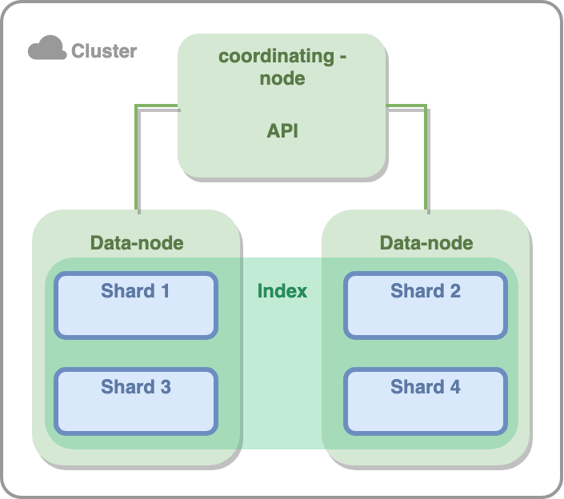

# ElasticSearch 
### Преимущества и недостатки ElasticSearch
Достоинства:
+ Легкая горизонтальная масштабируемость
+ Гибкая схема данных 
+ Полнотекстовый поиск и гибкий поиск по полям

Недостатки:
- Временной лаг между добавлением данных и их доступностью для поиска
- Нет ACID транзакций
- Недостаточная надежность хранения данных

Из всего этого можно сделать вывод, что ElasticSearch это поисковый движок и ее не стоит использовать как основную
базу для хранения данных.

Использовать ElasticSearch стоит в случаях:
1) Нужен полнотекстовый поиск.
2) Необходим гибкий поиск по всем полям.
3) Нужно собрать данные из разных источников.

### По какому протоколу общается клиент с сервером?
Клиент с сервером может общаться по HTTP или ES Native протоколу. Лучше использовать первый, как более понятный и 
общепринятый. Второй обычно используется для больших объемов данных.

Компоненты внутри Elastic кластера общаются с помощью ES Native протокола.

### Как Elastic хранит данные
Самая большая единица данных - **index**. Это аналог базы данных из реляционных БД. Внутри индекса могут храниться 
разные типы (**types**), это аналог таблиц из реляционных БД. Данные в типе разбиваются по шардам (**shards**), это способ 
партицирования в эластике. У каждого шарда есть **реплика** (может быть даже не одна). Таким образом, верхнеуровнего
все выглядит так:


Кол-во всех составляющих (кроме кластера) можно настроить, что позволяет гибко масштабировать кластер эластика.
Про ноды поговорим ниже

### Elastic nodes
Все шарды хранятся на нодах. Ноды в эластике бывают следующих типов:
1) Coordination node - ноды куда прилетают все запросы. Такая нода парсит запросы, приводит их к определенному виду и 
отправляет в data node. По этой причине таким нодам необязательно иметь большой объем hdd памяти, но нужен хороший 
процессор и ОЗУ. 
2) Data node - непосредственно нода, которая хранит и проводит поиск по данным. В идеале иметь SSD.
3) Master node - управляет топологией кластера: создает новый индекс, выделяет и распределяет шарды, перемещает их и 
объединять в случае необходимости. Мастер нода имеет реплики, каждая хранит номер версии кластера и в случае
выхода из строя мастер ноды, новый мастер выбирается исходя из номера версии. Новый мастер назначается голосованием  по
кворуму.

### Формат запросов к серверу
```bash
# Добавим документ c id 1 типа type в индекс index.
# ?pretty указывает, что вывод должен быть человеко-читаемым.
curl -XPUT "$ES_URL/{index}/{type}/1?pretty" -d'
{
  "title": "test title",
  "content": "test content",
  "tags": [
    "test",
    "elastic_test"
  ],
  "published_at": "2023-08-24T10:14:42+00:00"
}'

# извлечем документ по id типа type из индекса index
curl -XGET "$ES_URL/{index}/{type}/{id}/_source?pretty"

# Можно выбрать определенные поля
curl -XGET "$ES_URL/{index}/{type}/{id}?_source=field1?pretty"
```

### Состояния кластера 
Состояния может быть три:
- Зеленое: все primary и replica шарды в строю
- Желтое: все primary шары в строю, но некоторые реплики не отвечают
- Красное: Как минимум один primary шард не в строю

### Query vs Filter contexts
Elastic поддерживает два контекста при запросе: query context и filter context. Внешне выглядит так, что мы зачем-то
разделили условие на две части:
```
GET /_search
{
  "query": { 
    "bool": { # QUERY CONTEXT 
      "must": [
        { "match": { "title":   "Search"        }},
        { "match": { "content": "Elasticsearch" }}
      ],
      "filter": [ # FILTER CONTEXT
        { "term":  { "status": "published" }},
        { "range": { "publish_date": { "gte": "2015-01-01" }}}
      ]
    }
  }
}
```

На основе Query считается relevance score, который будет маркировать насколько результаты хорошо подходят query context.
По этой причине Query не кэшируются и могут выполняться дольше. Filters в свою очередь кэшируются, могут выполняться
быстрее и считать score им нет необходимости из-за бинарного результата фильтрации.

Фильтры используются:
1) Когда результат фильтра бинарен: да/нет
2) Для запросов по точным значениям (выпадашки в фильтрах)

Запросы используются:
1) Для полнотекстового поиска
2) Где результат фильтрации определен релевантностью (relevance score)

Чтобы оптимально построить поисковой запрос:
1) Пользуйтесь фильтрами, при правильной фильтрации до query context дойдет минимальное количество необходимых данных
и запрос обработается быстрее
2) Избегайте wildcards (*), в особенности leading wildcards (*clausetext)