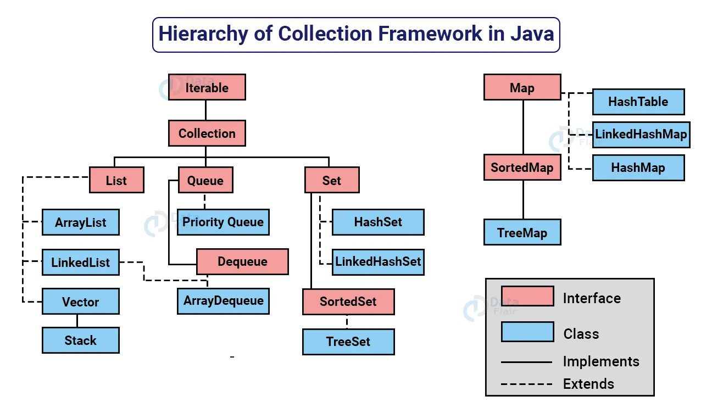
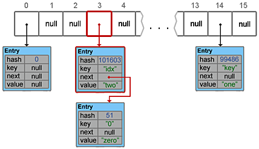

# Java Collections

- [Collections hierarchy](#heap-и-stack-память-в-java)
- [Итераторы: fail-fast и fail-safe](#итераторы-fail-fast-и-fail-safe)
- [Сложность операций](#сложность-операций)
- [ArrayList vs LinkedList](#arraylist-vs-linkedlist)
- [Как устроен HashMap](#как-устроен-hashmap)
- [Как устроен LinkedHashMap](#как-устроен-linkedhashmap)
- [Как устроен TreeMap](#как-устроен-treemap)
- [Как устроен любой Set](#как-устроен-любой-set)

## Collections hierarchy

## Итераторы: fail-fast и fail-safe
**fail-fast** поведение означает, что при возникновении ошибки или состояния, которое может привести к ошибке, 
система немедленно прекращает дальнейшую работу и уведомляет об этом. Использование fail-fast подхода позволяет избежать 
недетерминированного поведения программы в течение времени.

В Java Collections API итераторы стандартных коллекций ведут себя как fail-fast и выбрасывают ConcurrentModificationException, 
если после его создания была произведена модификация коллекции, т.е. добавлен или удален элемент напрямую из коллекции, 
а не используя методы итератора (например iterator.remove).

В противоположность fail-fast, итераторы **fail-safe** не вызывают никаких исключений при изменении структуры, потому 
что они работают с клоном коллекции вместо оригинала. Fail safe итераторы используются при работе с concurrent 
коллекциями.

## Сложность операций
**ArrayList**  
add(element) - O(1). С созданием нового массива O(N)  
add(element, index) - O(N)  
get(index) - O(1)  
remove(index) - O(N)  

**LinkedList**  
add(element) - O(1)  
add(element, index) - O(N)  
get(index) - O(N)  
remove(index) - O(N)  

**HashMap, LinkedHashMap**  
get(key) - O(1), если нет коллизии. Если есть - O(logN).  
put(key, element) - O(1), если нет коллизии. Если есть - O(logN).  

**TreeMap**  
get(key) - O(logN).  
put(key, element) - O(logN).  

**HashSet, LinkedHashSet**  
add(), remove(), contains() - O(1)  

**TreeSet**  
add(), remove(), contains() - O(logN)

## ArrayList vs LinkedList
ArrayList это список, реализованный на основе массива, а LinkedList — это классический двусвязный список, основанный 
на объектах со ссылками между ними.

ArrayList:
+ Доступ по индексу за O(1)
+ Вставка и удаление за O(n) в худшем случае, если придется переставлять все элементы и расширять массив.
+ На современных ОС сдвиг массива происходит быстро.

LinkedList:
+ Получение по индексу за O(n)
+ Вставка и удаление за O(1), но для вставки в середине нужно найти элемент по индексу за O(n)

## Как устроен HashMap?
В общем случае операции добавления, поиска и удаления элементов занимают константное время.

HashMap состоит из «корзин» (bucket). С технической точки зрения «корзины» — это элементы массива, которые хранят 
ссылки на списки элементов. При добавлении новой пары «ключ-значение», вычисляет хэш-код ключа. На его основании 
вычисляется номер корзины (номер ячейки массива), в которую попадет новый элемент. Если корзина пустая, то в нее 
сохраняется ссылка на вновь добавляемый элемент, если же там уже есть элемент, то происходит последовательный переход 
по ссылкам между элементами в цепочке, в поисках последнего элемента, от которого и ставится ссылка на вновь 
добавленный элемент. Если в списке был найден элемент с таким же ключом, то он заменяется.

Помимо capacity у HashMap есть еще поле loadFactor, на основании которого, вычисляется предельное количество занятых 
корзин capacity * loadFactor. По умолчанию loadFactor = 0.75. По достижению предельного значения, число корзин 
увеличивается в 2 раза и для всех хранимых элементов вычисляется новое «местоположение» с учетом нового числа корзин.

Алгоритм добавления элемента:
1) Сначала ключ проверяется на равенство null. Если это проверка вернула true, будет вызван метод putForNullKey(value)
2) Далее генерируется хэш на основе ключа.
3) С помощью метода indexFor(hash, tableLength), определяется позиция в массиве, куда будет помещен элемент.
4) Теперь, зная индекс в массиве, мы получаем список (цепочку) элементов, привязанных к этой ячейке. Хэш и ключ нового 
элемента поочередно сравниваются с хэшами и ключами элементов из списка и, при совпадении этих параметров, значение 
элемента перезаписывается.
5) Если же предыдущий шаг не выявил совпадений, будет вызван метод addEntry(hash, key, value, index) для добавления 
нового элемента.

## Как устроен LinkedHashMap
Идентично HashMap, но каждый Entry хранит указатель на предыдущий и следующий Entry.

## Как устроен TreeMap
TreeMap работает на основе красно-черного дерева, хеш не используется. Ключ используется для навигации и сортировки по
дереву.

## Как устроен любой Set
Аналогично идентичной реализации Map, но хранится только ключ, без значения.
