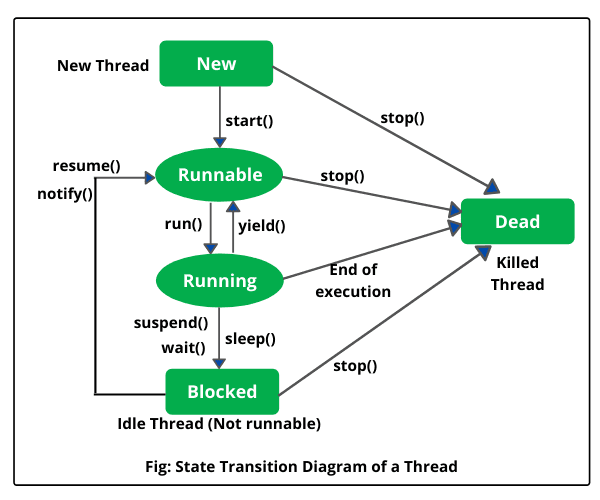

# Многопоточность

### Модель памяти Java
Модель памяти Java (Java Memory Model, JMM) описывает поведение потоков в среде исполнения Java. Это набор правил, 
описывающий выполнение многопоточных программ и правил, по которым потоки могут взаимодействовать друг с другом 
посредством основной памяти.

Также модель памяти определяет отношение -happens-before- между межпоточными действиями. Абстракция обозначает, 
что если операция X связана отношением happens-before с операцией Y, то весь код следуемый за операцией Y, 
выполняемый в одном потоке, видит все изменения, сделанные другим потоком, до операции X.

Существует несколько основных правил для отношения happens-before:
1) Освобождение монитора (unlock) happens-before захват того же монитора (lock);
2) Выход из synchronized блока happens-before вход в synchronized блок на том же мониторе;
3) Запись volatile поля happens-before чтение того же самого volatile поля;
4) Вызов метода start() экземпляра класса Thread happens-before начало метода run() экземпляра того же потока;
5) Завершение конструктора happens-before начало метода finalize() этого класса;
6) Вызов метода interrupt() на потоке happens-before обнаружению потоком факта прерывания;
7) Связь happens-before транзитивна, т.е. если X happens-before Y, а Y happens-before Z, то X happens-before Z.

Можно выделить несколько основных областей, имеющих отношение к модели памяти:

**Видимость (visibility).**  
Один поток может в какой-то момент временно сохранить значение некоторых полей не в основную память, а в локальный кэш 
процессора, таким образом второй поток, выполняемый на другом процессоре, читая из основной памяти, может не увидеть 
последних изменений поля. И наоборот, если поток на протяжении какого-то времени работает с локальными кэшами, читая 
данные оттуда, он может сразу не увидеть изменений, сделанных другим потоком в основную память.

К вопросу видимости имеют отношение следующие ключевые слов языка Java: `synchronized`, `volatile`, `final`.

При входе в synchronized метод или блок поток обновляет содержимое локальной памяти, а при выходе из synchronized 
метода или блока поток записывает изменения, сделанные в локальной памяти, в главную. Очень важно, что это правило 
работает только в том случае, если потоки синхронизируются, используя один и тот же монитор! Вытекает это из 
happens-before правил.

Что касается `volatile` переменных, то запись таких переменных производится в основную память, минуя локальную. И 
чтение volatile переменной производится также из основной памяти, то есть значение переменной не может сохраняться в 
локальной памяти потока и операция чтения этой переменной гарантированно вернёт последнее записанное в неё значение.

Также модель памяти определяет дополнительную семантику ключевого слова `final`, имеющую отношение к видимости. `Final` 
поля не требуют дополнительной синхронизации. После того как объект был корректно создан, любой поток может видеть 
значения его `final` полей без дополнительной синхронизации. «Корректно создан» означает, что ссылка на создающийся 
объект не должна использоваться до тех пор, пока не завершился конструктор объекта.

**Reordering (переупорядочивание)**  
Для увеличения производительности процессор/компилятор могут переставлять местами некоторые инструкции/операции. 
Вернее, с точки зрения потока, наблюдающего за выполнением операций в другом потоке, операции могут быть выполнены не 
в том порядке, в котором они идут в исходном коде. Тот же эффект может наблюдаться, когда один поток кладет результаты 
первой операции в регистр или локальный кэш, а результат второй операции попадает непосредственно в основную память. 
Тогда второй поток, обращаясь к основной памяти может сначала увидеть результат второй операции, и только потом 
первой, когда все регистры или кэши синхронизируются с основной памятью. Еще одна причина reordering, может заключаться 
в том, что процессор может решить поменять порядок выполнения операций, если, например, сочтет что такая 
последовательность выполнится быстрее.

Операции чтения и записи volatile переменных не могут быть переупорядочены с операциями чтения и записи других volatile 
и не-volatile переменных

### Что такое «потокобезопасность»?
Потокобезопасность – свойство объекта или кода, которое гарантирует, что при исполнении или использовании несколькими 
потоками, код будет вести себя, как предполагается.

### В чём разница между «конкуренцией» и «параллелизмом»?
Конкуренция — это способ одновременного решения множества задач.

Параллелизм — это способ решения одной задачи независимыми частями параллельно.

### Каким образом можно создать поток?
1) Создать потомка класса Thread и переопределить его метод run();
2) Создать объект класса Thread, передав ему в конструкторе экземпляр класса, реализующего интерфейс Runnable.
3) Вызвать метод submit() у экземпляра класса реализующего интерфейс ExecutorService, передав ему в качестве параметра 
экземпляр класса реализующего интерфейс Runnable или Callable

### Что такое «монитор» в Java?
**Монитор**, мьютекс (mutex) – это средство обеспечения контроля за доступом к ресурсу. У монитора может быть максимум 
один владелец в каждый текущий момент времени. Следовательно, если кто-то использует ресурс и захватил монитор для 
обеспечения единоличного доступа, то другой, желающий использовать тот же ресурс, должен подождать освобождения 
монитора, захватить его и только потом начать использовать ресурс.

В Java у каждого экземпляра объекта есть монитор, который контролируется непосредственно виртуальной машиной. 
Используется он так: любой нестатический synchronized-метод при своем вызове прежде всего пытается захватить монитор 
того объекта, у которого он вызван (на который он может сослаться как на this). Если это удалось – метод исполняется. 
Если нет – поток останавливается и ждет, пока монитор будет отпущен.

### Как работают методы wait() и notify()/notifyAll()?
Эти методы определены у класса Object и предназначены для взаимодействия потоков между собой при межпоточной синхронизации.

+ wait(): освобождает монитор и переводит вызывающий поток в состояние ожидания до тех пор, пока другой поток не 
вызовет метод notify()/notifyAll();
+ notify(): продолжает работу потока, у которого ранее был вызван метод wait();
+ notifyAll(): возобновляет работу всех потоков, у которых ранее был вызван метод wait().

wait(), notify() и notifyAll() должны вызываться только из синхронизированного кода. Это необходимо, потому что 
поток может вызвать методы wait() или notify() для определённого объекта, только если он в данный момент имеет 
блокировку на этот объект. Это защита от неудачной временной координации, которая может привести к тому, что notify 
вызывется до wait.

### В каких состояниях может находиться поток?

### Что такое deadlock?
Взаимная блокировка (deadlock) - явление, при котором все потоки находятся в режиме ожидания. Происходит, 
когда достигаются состояния:
1) **цикличного ожидания**: поток ждёт освобождения ресурса, другим потоком, который в свою очередь ждёт освобождения 
ресурса заблокированного первым потоком.
2) **удержания и ожидания**: поток удерживает как минимум один ресурс и запрашивает дополнительные ресурсов, которые 
удерживаются другими потоками.

Простейший способ избежать взаимной блокировки – не допускать цикличного ожидания. Этого можно достичь, получая 
мониторы разделяемых ресурсов в определённом порядке и освобождая их в обратном порядке.

### Что такое livelock?
livelock – тип взаимной блокировки, при котором несколько потоков выполняют бесполезную работу, попадая в зацикленность
при попытке получения каких-либо ресурсов.

Часто возникает при попытке предотвращения deadlock.

### volatile vs atomic
`volatile` принуждает использовать единственный экземпляр переменной, но не гарантирует атомарность. Например, 
операция count++ не станет атомарной просто потому, что count объявлена volatile. 

C другой стороны class AtomicInteger предоставляет атомарный метод для выполнения таких комплексных операций атомарно.

### Что такое «потоки-демоны»?
Потоки-демоны работают в фоновом режиме вместе с программой, но не являются неотъемлемой частью программы. Например, это
обслуживающие потоки JVM, такие как GC и тд.

Если в программе остались в работе только потоки демоны, то JVM автоматически убивает потоки демоны и завершает 
выполнение работы программы.

### Чем отличаются два интерфейса Runnable и Callable?
1) Метод Runnable.run() не возвращает никакого значения, Callable.call() возвращает объект Future, который 
может содержать результат вычислений;
2) Метод run() не может выбрасывать проверяемые исключения, в то время как метод call() может.

### Что такое FutureTask?
FutureTask представляет собой отменяемое асинхронное вычисление. Этот класс предоставляет базовую реализацию Future, 
с методами для запуска и остановки вычисления, методами для запроса состояния вычисления и извлечения результатов. 
Результат может быть получен только когда вычисление завершено, метод получения будет заблокирован, если вычисление 
ещё не завершено. Объекты FutureTask могут быть использованы для обёртки объектов Callable и Runnable. Так как 
FutureTask реализует Runnable, его можно передать в Executor на выполнение.

### Что такое race condition?
Состояние гонки (race condition) - ошибка проектирования многопоточной системы или приложения, при которой эта 
работа напрямую зависит от того, в каком порядке выполняются потоки.

### Почему не рекомендуется использовать метод Thread.stop()?
В таком случае поток умирает в не детерменированном состоянии. Непонятно, что делать с ресурсами потока.

Для остановки потока лучше использовать механизм прерывания.

### 