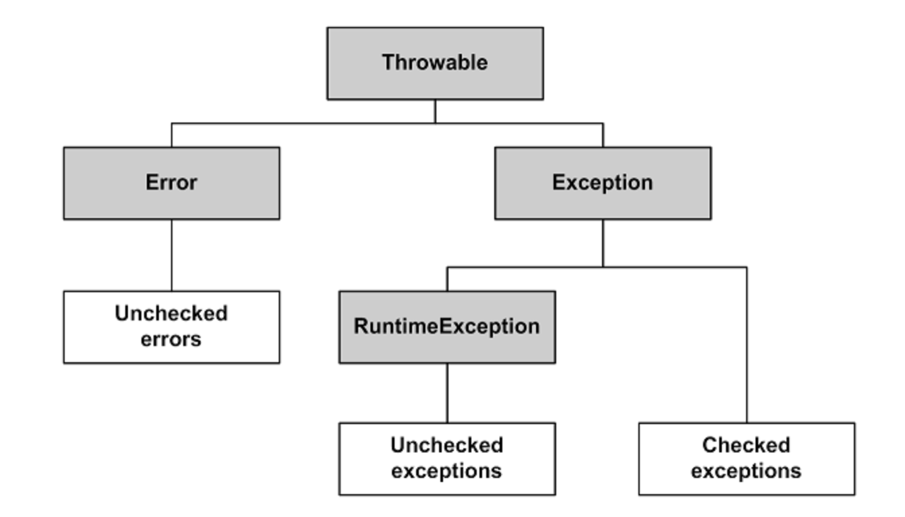

# Java CORE

- [Heap и Stack память в Java](#heap-и-stack-память-в-java)
- [Чем различаются JRE, JVM и JDK?](#чем-различаются-jre-jvm-и-jdk)
- [Модификаторы доступа](#модификаторы-доступа)
- [Система загрузки классов ](#система-загрузки-классов)
- [equals и hashcode](#equals-и-hashcode)


- [Может ли статический метод быть переопределён или перегружен?](#может-ли-статический-метод-быть-переопределён-или-перегружен)
- [Могут ли нестатические методы перегрузить статические?](#могут-ли-нестатические-методы-перегрузить-статические)
- [Можно ли объявить метод абстрактным и статическим одновременно?](#можно-ли-объявить-метод-абстрактным-и-статическим-одновременно)
- [Почему String неизменяемый и финализированный класс?](#почему-string-неизменяемый-и-финализированный-класс)
- [String.intern()](#stringintern)

### Heap и Stack память в Java
**Heap** (куча) используется Java Runtime для выделения памяти под объекты и классы. Создание нового объекта (**и его 
примитивных полей**) также происходит в куче. Это же является областью работы сборщика мусора. Любой объект (всё, что 
явно или неявно создаётся при помощи оператора new) хранится в куче.

**Stack** (стек) это область хранения данных также находящееся в общей оперативной памяти (RAM). Всякий раз, когда
вызывается метод, в памяти стека создается новый блок (frame), который содержит примитивы и ссылки на другие объекты из
переменных метода. Размер стековой памяти намного меньше объема памяти в куче.

### Чем различаются JRE, JVM и JDK?
**JVM**, Java Virtual Machine (Виртуальная машина Java) — основная часть среды выполнения Java (JRE). 
Виртуальная машина Java исполняет байт-код Java, предварительно созданный из исходного текста Java-программы 
компилятором Java. JVM может также использоваться для выполнения программ, написанных на других языках программирования.

**JRE**, Java Runtime Environment (Среда выполнения Java) - минимально-необходимая реализация виртуальной 
машины для исполнения Java-приложений. Состоит из JVM и стандартного набора библиотек классов Java.

**JDK**, Java Development Kit (Комплект разработки на Java) - JRE и набор инструментов разработчика приложений на языке 
Java, включающий в себя компилятор Java, стандартные библиотеки классов Java, примеры, документацию, различные утилиты.

### Модификаторы доступа
**private**: члены класса доступны только внутри класса.

**default**: видимость класса/членов класса только внутри пакета. Является модификатором доступа по умолчанию - 
специальное обозначение не требуется.

**protected**: члены класса доступны внутри пакета и в наследниках.

**public**: класс/члены класса доступны всем.

Во время наследования возможно изменения модификаторов доступа в сторону большей видимости 
(для поддержания соответствия принципу подстановки Барбары Лисков).


### Система загрузки классов
Самый душный вопрос из всех, что можно представить.
Всего система состоит из 3х частей: загрузка, линковка, инициализация.

**Загрузка**:  
При старте JVM самый базовый загрузчик bootstrap грузит необходимые для запуска JVM классы из стандартных библиотек.
Следующие ClassLoaders называются user defined, которые скорее JVM defined, так как поставляются вендорами виртуальных 
машин. ClassLoaders начиная с Main класса смотрят, какие классы необходимы для работы приложения и затем подгружают в 
память определения всех этих классов (.class файлов). Это называется **статическая загрузка классов**. 

В экзотических случаях возможно **загрузить класс динамически**. Например, мы грузим определения классов по сети и даем
право пользователю выбрать, какой класс он хочет создать (через ручной ввод). Затем при помощи `Class.forName` создать
этот свежеподгруженный класс:

```java
    InputStreamReader in = new InputStreamReader(System.in);
    BufferedReader reader = new BufferedReader(in);

    System.out.println("Enter Class Name: ");
    String whatClass = reader.readLine();

    Class exampleClass = Class.forName(whatClass);
    Object ob = exampleClass.newInstance();
```


**Линковка**:  
Процесс состоит из bytecode verification, class preparation (создание static полей), resolving (подстановка ссылок на 
используемые классы).

**Initialization**:
Вызов статических блоков инициализации и присваивание полям класса значений по умолчанию.

### equals и hashcode
Равные объекты должны возвращать одинаковые хэш коды. При переопределении equals() нужно обязательно
переопределять и метод hashCode().

Классы и методы, которые не используют правила этого контракта могут работать некорректно. Так для HashMap это
может привести к тому, что пара «ключ-значение», которая была в неё помещена при использовании нового экземпляра
ключа не будет в ней найдена.

Реализация метода Object.hashCode() описана как native, т.е. определенной не с помощью Java кода и обычно возвращает
адрес объекта в памяти

HashCode:
+ если хэш коды разные, то и объекты гарантированно разные;
+ если хэш коды равны, то объекты не обязательно равны (могут быть разные).


### Может ли статический метод быть переопределён или перегружен?
Перегружен - да. Всё работает точно так же, как и с обычными методами - 2 статических метода могут иметь одинаковое имя, 
если количество их параметров или типов различается.

Переопределён - нет. Выбор вызываемого статического метода происходит при раннем связывании (на этапе компиляции, а не 
выполнения) и выполняться всегда будет родительский метод, хотя синтаксически переопределение статического метода - 
это вполне корректная языковая конструкция.

В целом, к статическим полям и методам рекомендуется обращаться через имя класса, а не объект.

### Могут ли нестатические методы перегрузить статические?
Да. В итоге получится два разных метода. Статический будет принадлежать классу и будет доступен через его имя, а 
нестатический будет принадлежать конкретному объекту и доступен через вызов метода этого объекта.

### Можно ли объявить метод абстрактным и статическим одновременно?
Нет. Модификатор abstract говорит, что метод будет реализован в другом классе, а static наоборот указывает, что этот 
метод будет доступен по имени класса.

### Почему String неизменяемый и финализированный класс?
- Пул строк возможен только потому, что строка неизменяемая, таким образом виртуальная машина сохраняет больше 
свободного места в Heap, поскольку разные строковые переменные указывают на одну и ту же переменную в пуле.
- Неизменяемость позволяет избежать необходимости в синхронизации

### String.intern()
Метод intern() используется для сохранения строки в пуле строк или получения ссылки, если такая строка уже
находится в пуле.

Таким образом:
```java
class InternExample {
    public void internShowCase() {
      new String("Hello") == new String("Hello") // false
      new String("Hello").intern() == new String("Hello").intern() // true
    }
}
```


### Есть ли какие-либо рекомендации о том, какие поля следует использовать при подсчете hashCode()?
Общий совет: выбирать поля, которые с большой долью вероятности будут различаться. Для этого необходимо 
использовать уникальные, лучше всего примитивные поля, например, такие как id, uuid. При этом нужно следовать 
правилу, если поля задействованы при вычислении hashCode(), то они должны быть задействованы и при выполнении equals().

### Иерархия исключений
Исключения делятся на несколько классов, но все они имеют общего предка — класс Throwable, потомками которого являются 
классы Exception и Error.

Ошибки (Errors) представляют собой более серьёзные проблемы, которые, согласно спецификации Java, не следует 
обрабатывать в собственной программе, поскольку они связаны с проблемами уровня JVM. Например, исключения 
такого рода возникают, если закончилась память доступная виртуальной машине.

Исключения (Exceptions) являются результатом проблем в программе, которые в принципе решаемы, предсказуемы и 
последствия которых возможно устранить внутри программы. Например, произошло деление целого числа на ноль.

В Java все исключения делятся на два типа:
+ **checked** (проверяемые исключения) должны обрабатываться блоком catch или описываться в заголовке метода. Наличие 
такого обработчика/модификатора в заголовке метода проверяется на этапе компиляции;
+ **unchecked** (непроверяемые исключения), к которым относятся ошибки Error и исключения времени выполнения, 
представленные классом RuntimeException и его наследниками, которые могут не обрабатываться блоком catch и не быть 
описанными в заголовке метода.

 

### Виды ссылок в Java

**Обычная жесткая ссылка** – любая переменная ссылочного типа. Очистится сборщиком мусора не раньше, чем станет 
неиспользуемой (перестанет быть доступной из GC roots).  
**SoftReference** – мягкая ссылка. Объект не станет причиной израсходования всей памяти – гарантированно будет удален 
до возникновения OutOfMemoryError. Может быть раньше, зависит от реализации сборщика мусора.  
**WeakReference** – слабая ссылка. Слабее мягкой. Не препятствует утилизации объекта, сборщик мусора игнорирует такие 
ссылки.  
**PhantomReference** – фантомная ссылка. Используется для «предсмертной» обработки объекта: объект доступен после 
финализации, пока не очищен сборщиком мусора.  

Сборщик мусора освободит память объекта, если на него указывают только слабые ссылки.

### Сериализация
**Сериализация (Serialization)** - процесс преобразования структуры данных в линейную последовательность байтов для 
дальнейшей передачи или сохранения. Сериализованные объекты можно затем восстановить (десериализовать).

При использовании Serializable применяется алгоритм сериализации, который с помощью рефлексии (Reflection API) выполняет:
+ запись в поток метаданных о классе, ассоциированном с объектом (имя класса, идентификатор SerialVersionUID, 
идентификаторы полей класса);
+ рекурсивную запись в поток описания суперклассов до класса java.lang.Object (не включительно);
+ запись примитивных значений полей сериализуемого экземпляра, начиная с полей самого верхнего суперкласса;
+ рекурсивную запись объектов, которые являются полями сериализуемого объекта.

### Как исключить поля из сериализации?
Для управления сериализацией при определении полей можно использовать ключевое слово `transient`, таким образом исключив 
поля из общего процесса сериализации.

### Сериализация static
При стандартной сериализации поля, имеющие модификатор static, не сериализуются.

### Какая роль поля serialVersionUID в сериализации?
`serialVersionUID` используется для указания версии сериализованных данных.

Когда мы не объявляем `serialVersionUID` в нашем классе явно, среда выполнения Java делает это за нас, но этот процесс 
чувствителен ко многим метаданным класса включая количество полей, тип полей, модификаторы доступа полей, интерфейсов, 
которые реализованы в классе и пр.

Рекомендуется явно объявлять `serialVersionUID` т.к. при добавлении, удалении атрибутов класса динамически сгенерированное 
значение может измениться и в момент выполнения будет выброшено исключение InvalidClassException.

`serialVersionUID` нужно изменять при внесении в класс несовместимых изменений, например при удалении какого-либо его 
атрибута.

# Java reflection API

### Dynamic proxies
Динамические прокси Java - объекты, которые оборачивают исходный объект и перенаправляют ему все вызовы. Обычно они 
выполняют какую-нибудь служебную работу перед вызовом функции: записи в лог, замер времени работы и тд.

Перенаправление вызовов метода происходит с помощью `InvocationHandler`. Все вызовы адресуются методу 
`InvocationHandler.handle`, а этот метод адресует вызовы дальше исходному объекту.

```java

public class LoggingInvocationHandler implements InvocationHandler {

    private static Logger LOGGER = LoggerFactory.getLogger(LoggingInvocationHandler.class);

    @Override
    public Object invoke(Object proxy, Method method, Object[] args) throws Throwable {
        LOGGER.info("Invoked method: {}", method.getName());

        return method.invoke(args);
    }
}

public class Main {
    public static void main(String[] args) {
        Cat dynamicProxyCat = (Cat) java.lang.reflect.Proxy.newProxyInstance(
                Main.class.getClassLoader(),
                new Class[] { Cat.class },
                new LoggingInvocationHandler()
        );

        dynamicProxyCat.meow(); // Invoked method: meow
    }
}


```


### Dynamic and Static class loading
Джава лениво загружает необходимые ей классы в рантайме. Все классы изначально скомпилированы, но чтобы не держать
в памяти (в стеке) данные обо всех классах, джава подгружает не все классы сразу.

Перед стартом приложения джава смотрит Main класс, загружает его и все классы, что используются в Main. Далее она 
переходит в используемые классы и делает то же самое. Это происходит еще во время этапа компиляции и называется Static
class loading.

Динамическая загрузка классов нужна, чтобы подгрузить классы, которые статическая загрузка найти не смогла. Например,
какое-то модульное приложение, в рантайм к которому подложили новый жарник. Особенно остро стоит вопрос, если 
приложение statefull и не хочется сбрасывать состояние при перезапуске. Динамическая подгрузка происходит с помощью
ClassLoader:

```java

public class MainClass {

    public static void main(String[] args) {
        ClassLoader classLoader = MainClass.class.getClassLoader();

        try {
            Class dynamicClass = classLoader.loadClass("ru.example.MyDynamicClass");
            System.out.println("MyDynamicClass.getName() = " + dynamicClass.getName());
        } catch (ClassNotFoundException e) {
            e.printStackTrace();
        }
    }
}
```

Динамическая перезагрузка класса - тема отдельная и сложная. Перед загрузкой класса ClassLoader проверяет, а не был ли
еще загружен этот класс. Если был, то перезагрузка не происходит. В качестве обходного пути можно использовать
другой ClassLoader отличный от первого, но подгруженный таким ClassLoader класс нельзя привести к подгруженному
классу первого ClassLoader. Поскольку в идентификацию класса так же входит название ClassLoader, который его загрузил.
В качестве решения - приводить подгруженный другим ClassLoader класс к общему интерфейсу.

### Нововведения разных версий Java
Java 11:
1) Новые API в String и многих других классах
2) var в лямбде
3) новый ZGC сборщик

Java 12-15:
1) Switch возвращает выражение (Java 14 релиз)
2) Текстовые блоки (Java 15 релиз)
3) Записи (records) (Java 16 релиз)
4) Паттерны для instanceof (Java 16 релиз)

Java 17:
1) LTS
2) Доступ к API внешней памяти

Java 18:
1) UTF-8 по умолчанию (независимо от платформы)
