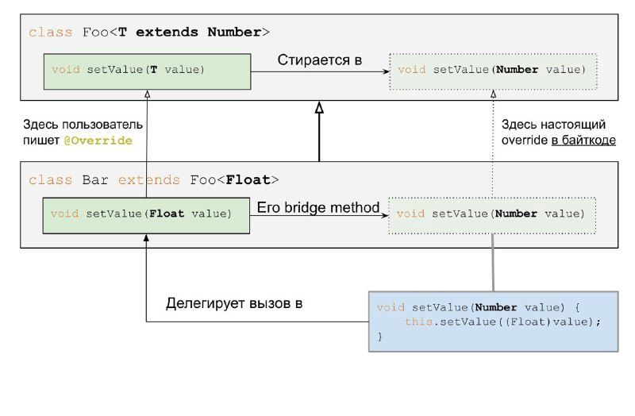

# Java generics
### Примеры
Generic class:
```java
public class GenericsType<T> {

	private T t;
	
	public T get(){
		return this.t;
	}
	
	public void set(T t1){
		this.t=t1;
	}

}
```

Generic method:
```java
public class GenericsMethods {

	public static <T> boolean isEqual(GenericsType<T> g1, GenericsType<T> g2){
		return g1.get().equals(g2.get());
	}
    
}
```

### Wildcards
`<? extends ...>` и `<? super ...>` называются wildcards или символом подстановки. 

`List<? extends Number>` может содержать объекты, класс которых является Number или наследуется от Number. Из такого
контейнера данные можно **только читать**.
`List<? super Number>` может содержать объекты, класс которых Number или Number является наследником (супертип от 
Number). В такой контейнер данные можно **только записывать**.

`<? extends Number>` ковариантен:
```java
List<Integer> ints = new ArrayList<Integer>();
List<? extends Number> nums = ints;
```

`<? super Integer>` контрвариантен:
```java
List<Number> nums = new ArrayList<Number>();
List<? super Integer> ints = nums;
```

### PECS
Чтобы было легче запомнить, когда какой wildcard использовать, существует принцип PECS — Producer Extends Consumer Super.

- Если мы объявили wildcard с extends, то это producer. Он только «продюсирует», предоставляет элемент из контейнера, а сам ничего не принимает.
- Если же мы объявили wildcard с super — то это consumer. Он только принимает, а предоставить ничего не может.

### ко|контр|ин-вариантность

**Ковариантность** — сохранение иерархии наследования исходных типов в производных типах в том же порядке. 

Например, если Кошка — это подтип Животные, то Множество<Кошки> — это подтип Множество<Животные>. Получается:
`List<Животные> = List<Кошки>`

Массивы в Java ковариантны:
```java
String[] strings = new String[] {"a", "b", "c"};
Object[] arr = strings;
```

**Контравариантность** — это обращение иерархии исходных типов на противоположную в производных типах. 

Например, если Кошка — это подтип Животные, то Множество<Животные> — это подтип Множество<Кошки>. Получается:
`List<Кошки> = List<Животные>`

**Инвариантность** — отсутствие наследования между производными типами. 

Если Кошка — это подтип Животные, то Множество<Кошки> не является подтипом Множество<Животные> и Множество<Животные> не является подтипом Множество<Кошки>.

Дженерики в Java инвариантны:
```java
List<Integer> ints = Arrays.asList(1,2,3);
List<Number> nums = ints; // compile-time error. Проблема обнаружилась на этапе компиляции
```

### Type erasure
Во время компиляции информация о дженериках стирается из кода и остается только в метаданных класса и методов. 

```java
List<String> list = new ArrayList<String>();
list.add("Hi");
String x = list.get(0);
```
скомпилируется в 
```java
List list = new ArrayList();
list.add("Hi");
String x = (String) list.get(0);
```

Стирание состоит из трех действий:
- Если параметры ограничены (bounded), вместо типа-параметра в местах использования подставляется верхняя граница, иначе Object;
- В местах присвоения значения типа-параметра в переменную обычного типа добавляется каст к этому типу;
- Генерируются bridge-методы.

### Bridge методы
Когда дженерик параметр конкретизируется в наследнике, методы с аргументами этого дженерик типа больше не 
совпадают в байткоде – в наследнике тип конкретный, а в родителе стертый до верхней границы.

Проблема решается простым и безопасным кастом. Компилятор генерирует новый метод, который совпадает по сигнатуре 
с родительским. В его теле параметр кастуется и вызов делегируется в пользовательский метод. Это и называется 
bridge методом.

Попытка написать такой же метод вручную приведет к ошибке компиляции.

