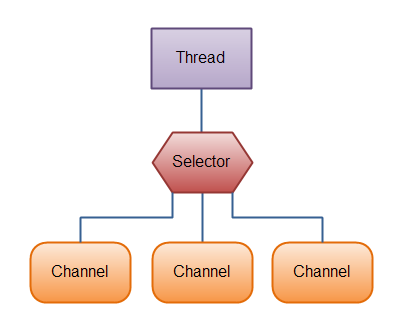

# Потоки ввода/вывода в Java

### В чём заключается разница между IO и NIO?

| Java IO                | Java NIO                 |
|------------------------|--------------------------|
| Потокоориентированный  | Буфер-ориентированный    |
| Блокирующий ввод/вывод | Неблокирующий ввод/вывод |
|                        | Селекторы и каналы       |

**Потокоориентированность и буфер ориентированность**  
Потокоориентированный ввод подразумевает чтение из потока N байт в единицу времени поочередно. Аналогично с выводом.
Данная информация нигде не кешируется. Таким образом, невозможно произвольно двигаться по потоку данных вперед или назад.

Подход, на котором основан Java NIO немного отличается. Данные считываются в буфер для последующей обработки. Вы можете 
двигаться по буферу вперед и назад. Это дает немного больше гибкости при обработке данных. В то же время, вам необходимо 
проверять содержит ли буфер необходимый для корректной обработки объем данных.

**Блокирующий и неблокирующий ввод/вывод**  
Потоки ввода/вывода в Java IO являются блокирующими. Это значит, что когда в потоке выполнения вызывается read() или 
write() любого класса из пакета java.io.*, происходит блокировка до тех пор, пока данные не будут считаны или 
записаны. Поток выполнения в данный момент не может делать ничего другого. 

Неблокирующий режим Java NIO позволяет запрашивать считанные данные из канала (channel) и получать только то, что
доступно на данный момент, или вообще ничего, если доступных данных пока нет. Вместо того, чтобы оставаться 
заблокированным пока данные не станут доступными для считывания, поток выполнения может заняться чем-то другим. 

### Каналы Java NIO
Каналы – это логические (не физические) порталы, через которые осуществляется ввод/вывод данных, а буферы являются 
источниками или приёмниками этих переданных данных. При организации вывода, данные, которые вы хотите отправить, 
помещаются в буфер, а он передается в канал. При вводе, данные из канала помещаются в предоставленный вами буфер.

Каналы напоминают трубопроводы, по которым эффективно транспортируются данные между буферами байтов и сущностями по ту 
сторону каналов. 

### Селекторы Java NIO
Селекторы в Java NIO позволяют одному потоку выполнения мониторить несколько каналов ввода. Вы можете зарегистрировать 
несколько каналов с селектором, а потом использовать один поток выполнения для обслуживания каналов, имеющих доступные 
для обработки данные, или для выбора каналов, готовых для записи.

### Назовите основные классы потоков ввода/вывода.
+ **байтовые** - java.io.InputStream, java.io.OutputStream;
+ **символьные** - java.io.Reader, java.io.Writer.

### Что такое «абсолютный путь» и «относительный путь»?
**Абсолютный (полный) путь** — это путь, который указывает на одно и то же место в файловой системе, вне зависимости от 
текущей рабочей директории или других обстоятельств. Полный путь всегда начинается с корневого каталога.

**Относительный путь** представляет собой путь по отношению к текущему рабочему каталогу пользователя или активного 
приложения.

