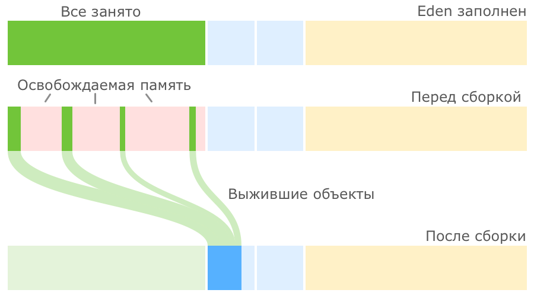

# Модель памяти Java
Каждый поток имеет свой стек, но все потоки имеют общую кучу. Схематично модель памяти Java выглядит так:


В стеке каждого потока хранятся фреймы - данные вызовов каждого метода. Примитивные аргументы методов хранятся
непосредственно в стеке, объекты (и их поля) хранятся в куче. Даже если два потока одновременно выполняют
один и тот же метод, все равно каждый будет иметь свою копию фрейма с аргументами в стеке. 


Современная аппаратная реализация памяти такая:


Каждый процессор может иметь несколько ядер, каждое ядро имеет свой регистр и кеш. Регистр и кеш - это память в 
процессоре для ускоренного доступа к данным. Стеки потоков и куча могут быть расположены во всех частях этой памяти. 
То есть что-то может храниться в регистре, что-то в кеше, что-то в ОЗУ. 

Отсюда могут возникнуть две проблемы:
1) Видимость изменений объектов
2) Состояние гонки

**Видимость объектов**  
Если два или более потока делят между собой объект без надлежащего использования volatile-объявления или синхронизации,
то изменения общего объекта, сделанные одним потоком, могут быть невидимы для других потоков.

Допустим, общий объект хранится в ОЗУ. Ядро_1 считывает общий объект себе в кеш или регистр и изменяет его. Пока кеш и
регистр ядра_1 не будет сброшен в ОЗУ, другие ядра не увидят изменений общего объекта. Таким образом каждый поток может
получить свою версию объекта. Для решения этой проблемы используют ключевое слово `volatile`, оно гарантирует, что такая
переменная будет считываться и зписываться непосредственно в ОЗУ. 

**Состояние гонки**  
Каждое ядро в своем кеше может выполнить изменение общего объекта и перезаписать чужое изменение при переносе общего
объекта в ОЗУ. Либо в случае неудачного временного координирования, такое может произойти даже с valotile переменной, 
если два ядра будут изменять объект одновременно.

Для решения этой проблемы использует синхронизированные блоки. Синхронизированные блоки также гарантируют, что все
переменные, к которым обращаются внутри синхронизированного блока, будут считаны из основной памяти, и когда поток 
выйдет из синхронизированного блока, все обновленные переменные будут снова сброшены в основную память, независимо от 
того, объявлена ли переменная как volatile или нет.

## Happens-before
Happens-before определяется как отношение между двумя действиями:

1) Пусть есть поток T1 и поток T2 (необязательно отличающийся от потока T1) и действия x и y, выполняемые в 
потоках T1 и T2 соответственно
2) Если x happens-before y, то во время выполнения y треду T2 будут видны все изменения, выполняемые в x тредом T1

Однако это не означает, что эти действия будут выполняться друг за другом. Дается гарантия только видимости изменений.
Если продолжать эту тему, последовательно будут выполняться лишь те действия, которые влияют на чтение данных друг друга.

Важно отметить, что отношение happens-before является транзитивным. То есть, если hb(x,y) и hb(y,z), то hb(x,z).

Примеры happens-before:
1) Два последовательных действия в одном треде
2) Освобождение монитора happens-before каждый последующий захват **того же самого** монитора
3) Запись в volatile переменную happens-before каждое последующее чтение той же самой переменной
4) Финальное действие в треде T1 happens-before любое действие в треде T2, которое обнаруживает, что тред T1 завершен
5) Действие запуска треда (Thread.start()) happens-before первое действие в этом треде
6) Если тред T1 прерывает тред T2, то интеррапт happens-before обнаружение интеррапта
7) Дефолтная инициализация (0, false или null) при создании переменной happens-before первое действие в каждом треде

# Java Garbage Collectors (GC)
Алгоритмы для обнаружения мусора:
1) Reference Counting - каждый объект ведет подсчет ссылок, которые на него ссылаются. Сложно обеспечить точность
счетчика и невозможно обнаружить циклические зависимости, так что от этого алгоритма отказались.
2) Tracing - главная идея - до живого объекта можно циклически дойти от корня всех живых ссылок. Корнем всех ссылок 
являются: main поток, параметры main метода и его локальные переменные, статические переменные main класса.

Все современные GC построены на основе General Garbage Collection. Смысл этого механизма:
1) Куча делится на 3 области: Eden, Survivor, Tenured. 
2) Все создаваемые объекты попадают в Eden.
3) Долгоживущие объекты попадают сначала в Survivor, затем в Tuned. 
4) Очистка бывает 2-х видов: упрощенная (чистится только Eden и Survivor) и полная (в том числе чистится Tenured)

### Serial Garbage Collector
Куча делится на 4 региона (Eden, Survivor 0, Survivor 1, Tenured). 


Объект начинает жизнь в Eden. Когда Eden заполняется, включается малая сборка мусора. Первым делом такая сборка 
находит и удаляет мертвые объекты из Eden. Оставшиеся живые объекты переносятся в пустой регион Survivor. Один из 
двух регионов Survivor всегда пустой, именно он выбирается для переноса объектов из Eden:



После малой сборки регион Eden полностью очищен и может быть использован для размещения новых объектов. Но рано или 
поздно наше приложение опять займет всю область Eden и JVM снова запустит малую сборку, на этот раз очищая Eden и 
частично занятый Survivor 0, после чего перенося все выжившие объекты в пустой регион Survivor 1:


В следующий раз в качестве региона назначения опять будет выбран Survivor 0. Пока места в регионах Survivor достаточно, 
все идет хорошо. JVM постоянно следит за тем, как долго объекты перемещаются между Survivor 0 и Survivor 1, и 
выбирает подходящий порог для количества таких перемещений, после которого объекты перемещаются в Tenured, то есть 
переходят в старшее поколение. Если регион Survivor оказывается заполненным, то объекты из него также
отправляются в Tenured:


Когда место заканчивается в Tenured, запускается полная сборка мусора. Она работает со всей кучей. Младшие регионы
обрабатываются как в малой сборке, а старшие регионы чистятся от мертвых объектов и уплотняются. Такой механизм 
очистки называется Mark-Sweep-Compact по названию его шагов (пометить выжившие объекты, очистить память от мертвых 
объектов, уплотнить выжившие объекты).


Малая и полная сборка полностью останавливают поток выполнения программы. Данная проблема называется stop-the-world 
(STW).

**Достоинства**:
1) Непритязательность к ресурсам ПК.
**Недостатки**:
1) Слишком долгие паузы (STW), так как оба этапа сборки полностью останавливают программу.

**Настройка:**
`Xms, Xmx` - начальный и максимальный размер кучи.  
`-XX:MinHeapFreeRatio=? -XX:MaxHeapFreeRatio=?` - min и max доля свободного места в каждом поколении, при 
достижении которой размер поколения будет автоматически увеличен или уменьшен.  
`-XX:NewRatio=?` - желаемое отношение размера старшего поколения к суммарному размеру регионов младшего поколения.  
`-XX:NewSize=? -XX:MaxNewSize=?` - ограничить размер младшего поколения абсолютными величинами снизу и сверху.  
`-XX:SurvivorRatio=?` - отношение размера Eden к размерам Survivor.  
`-XX:-UseGCOverheadLimit` - отключить порог активности сборщика в 98%, при достижении которого возникает OutOfMemoryError.

### G1
Сборщик мусора по умолчанию начиная с JDK 9. 

Память разбивается на множество регионов одинакового размера. Размер этих регионов зависит от общего размера кучи и 
по умолчанию выбирается так, чтобы их было не больше 2048, обычно получается от 1 до 32 МБ. Регионы могут объединяться
для хранения больших объектов.


Малые сборки запускаются периодически в несколько потоков, приложение в это время останавливается. Отличие состоит в 
том, что очистка только на части регионов, которые сборщик сможет очистить не превышая желаемого времени. Выбираются 
при этом регионы, очистка которых принесет максимальную очистку мусора.

Параллельно с выполнением программы G1 периодически запускает процессы цикла пометки (marking cycle). Этот процесс:
1) Помечает корневых объектов в куче (остановка приложения)
2) Пометка всех остальных живых объектов в куче
3) Дополнительный поиск всех неучтенных живых объектов (остановка приложения)
4) Поиск пустых регионов, куда можно разместить объекты

После окончания этого процесса G1 переключается на выполнение mixed чистки (аналог полной). Это означает, что в каждой
малой сборке помимо Eden и Survive регионов будут рассматриваться и tenured. Eden и Survive регионы чистятся по 
известному алгоритму, Tenured удаляются те, которые помечены как мертвые после marking cycle.

Количество mixed чисток и количество очищаемых регионов выбирается исходя из имеющейся у сборщика статистики о 
предыдущих сборках таким образом, чтобы не выходить за требуемое время сборки. Как только сборщик очистил достаточно 
памяти, он переключается обратно в режим малых сборок.

С точки зрения JVM любой объект размером больше половины региона считается громадным, помещается в громадный регион 
и обрабатывается специальным образом:
1) Он никогда не перемещается между регионами.
2) Он может удаляться в рамках цикла пометки или полной сборки мусора.
3) В регион, занятый громадным объектом, больше никого не подселяют, даже если в нем остается свободное место.

**Достоинства**:
1) Минимизация STW и аккуратное предсказывание размеров пауз (задается настройкой)
2) Не фрагментирует память
**Недостатки**:
1) Большая нагрузка на процессор и как следствие уменьшение пропускной способности программы

**Настройки**:
`-XX:MaxGCPauseMillis=?` - приемлемое для нас максимальное время разовой сборки мусора.  
`-XX:ParallelGCThreads=? -XX:ConcGCThreads=?` - количество потоков для сборки мусора и для выполнения цикла пометок.  
`-XX:G1HeapRegionSize=?` - выбор размера региона, значение степень двойки.  
`-XX:InitiatingHeapOccupancyPercent=?` - порог заполненности кучи, при достижении которого инициируется выполнение 
цикла пометок и переход в режим смешанных сборок.  

### ZGC
Production ready начиная с JDK 14.

Для понимания принципа работы важно понимать, что несколько ячеек виртуальной памяти может смотреть на одну ячейку 
физической памяти, никак при этом не увеличивая использование этой физической памяти.

ZGC использует алгоритм **покраски указателей**. Сам адрес варьируется от 42 до 44 бит. Следующие 4 бита используются под 
метаданные указателя:
- Marked0 (0001) и Marked1 (0010) — используются для пометки указателей на разных фазах сборки.
- Remapped (0100) — адрес в указателе является окончательным и не должен модифицироваться в рамках текущего цикла сборки.
- Finalizable (1000) — этим битом помечаются объекты, достижимые только из финализатора.

Комбинация этих флагов называется цветом указателя.


Таким образом, разные цвета одного и того же указателя будут указывать на разные ячейки виртуальной памяти, которые 
будут указывать на одну и ту же ячейку физической памяти.

Еще одна важная деталь - использование **барьеров**. Барьеры - функции которая исходя из цвета указателя на объект 
может производить какие-то действия с этим указателем или объектом. Функции барьеры могут выполняться потоками **самого 
приложения**, что негативно сказывается на производительности.

**Принцип работы**:
Поиск живых объектов достижимых из корней. Для этого ZGC использует короткую STW-паузу.


После того как найдены все объекты, достижимые из корней, работа приложения возобновляется и начинается вторая фаза 
сборки, в которой сборщик продолжает поиск живых объектов, достижимых из найденных корней, но уже в конкурентном режиме.
В этот период активно используются барьеры. После завершения конкурентной фазы опять возникает пауза STW, в рамках 
которой ZGC обрабатывает различные специальные кейсы. В итоге получаем все живые объекты. 


Определение блоков памяти, объекты из которых подлежат перемещению. Это блоки, в которых находится достаточно много 
мертвых объектов, чтобы их перемещение приносило пользу:


Перемещение объектов. Начинается с объектов, достижимых из корней, и производится в рамках паузы STW.


Перенос остальные объектов в конкурентном режиме. Активно используются барьеры.


Все объекты оказываются перемещенными в целевые области памяти. Остались только зависшие указатели на объекты в
освобожденных регионах памяти (они остались красными на схеме). Чтобы поправить все такие указатели, необходимо 
совершить еще один обход графа объектов, проследовав по всем указателям и перенаправив их на новые адреса.

**Достоинства**:
1) Очень короткие простои STW даже на очень больших кучах
**Недостатки**:
1) Длительные конкурентные фазы - страдает пропускная способность приложения
2) Дорогие в использование барьеры - страдает пропускная способность
3) Большое количество свободных регионов памяти - нужно больше памяти

**Настройка**:
`-XX:ZFragmentationLimit=percent` - процент фрагментации, при достижении которого блок памяти попадает в набор для
перемещения.  
`-XX:ZCollectionInterval=seconds` - установить максимальное время между чистками.  
`-XX:ZAllocationSpikeTolerance=factor` - насколько большие всплески активности по выделению новой памяти ожидает 
сборщик. На основании таких ожиданий ZGC планирует последующие сборки.  
`-XX:+ZProactive` - проактивный режим, в котором ZGC может инициировать сборки мусора в случаях, когда явной 
необходимости в этом нет, но ожидаемое влияние на работу основных потоков приложения минимально.  
`-XX:ConcGCThreads=threads` - кол-во потоков на сборку мусора.

## Чтение логов GC
Включить логи GC в JDK 9+ `-Xlog:gc*`. Параметр `gc+phases=debug` включает дебаг режим логов.

Пример логов:
```
2019-11-03T21:26:21.827-0100: 2.069: [GC pause (G1 Evacuation Pause) (young)
Desired survivor size 2097152 bytes, new threshold 15 (max 15)
- age   1:     341608 bytes,     341608 total
, 0.0021740 secs]
   [Parallel Time: 0.9 ms, GC Workers: 10]
      [GC Worker Start (ms): Min: 2069.4, Avg: 2069.5, Max: 2069.6, Diff: 0.1]
      [Ext Root Scanning (ms): Min: 0.1, Avg: 0.2, Max: 0.4, Diff: 0.3, Sum: 1.5]
      [Update RS (ms): Min: 0.1, Avg: 0.2, Max: 0.3, Diff: 0.2, Sum: 2.3]
         [Processed Buffers: Min: 1, Avg: 1.4, Max: 4, Diff: 3, Sum: 14]
      [Scan RS (ms): Min: 0.0, Avg: 0.0, Max: 0.0, Diff: 0.0, Sum: 0.0]
      [Code Root Scanning (ms): Min: 0.0, Avg: 0.0, Max: 0.0, Diff: 0.0, Sum: 0.0]
      [Object Copy (ms): Min: 0.2, Avg: 0.3, Max: 0.3, Diff: 0.1, Sum: 3.0]
      [Termination (ms): Min: 0.0, Avg: 0.0, Max: 0.0, Diff: 0.0, Sum: 0.0]
         [Termination Attempts: Min: 1, Avg: 1.0, Max: 1, Diff: 0, Sum: 10]
      [GC Worker Other (ms): Min: 0.0, Avg: 0.0, Max: 0.0, Diff: 0.0, Sum: 0.1]
      [GC Worker Total (ms): Min: 0.6, Avg: 0.7, Max: 0.8, Diff: 0.1, Sum: 7.0]
      [GC Worker End (ms): Min: 2070.2, Avg: 2070.2, Max: 2070.2, Diff: 0.0]
   [Code Root Fixup: 0.0 ms]
   [Code Root Purge: 0.0 ms]
   [Clear CT: 0.2 ms]
   [Other: 1.1 ms]
      [Choose CSet: 0.0 ms]
      [Ref Proc: 0.8 ms]
      [Ref Enq: 0.0 ms]
      [Redirty Cards: 0.2 ms]
      [Humongous Register: 0.0 ms]
      [Humongous Reclaim: 0.0 ms]
      [Free CSet: 0.0 ms]
   [Eden: 26.0M(26.0M)->0.0B(30.0M) Survivors: 5120.0K->3072.0K Heap: 51.4M(64.0M)->22.6M(64.0M)]
 [Times: user=0.01 sys=0.00, real=0.01 secs]
```

Из этого лога видно, что произошла чистка young части кучи `[GC pause (G1 Evacuation Pause) (young)`. Чистка 
завершилась таким результатом:
1) Eden область отчистилась полностью 26.0M(26.0M)->0.0B(30.0M). К тому же увеличился максимальный размер Eden области
2) Survivors очистилось с 5120.0K до 3072.0K
3) Общая куча очистилась с 51.4M до 22.6M из 64.0M максимально возможных

Так же в логе куча информации о тайминге выполнения различных операций потоками в ms. 