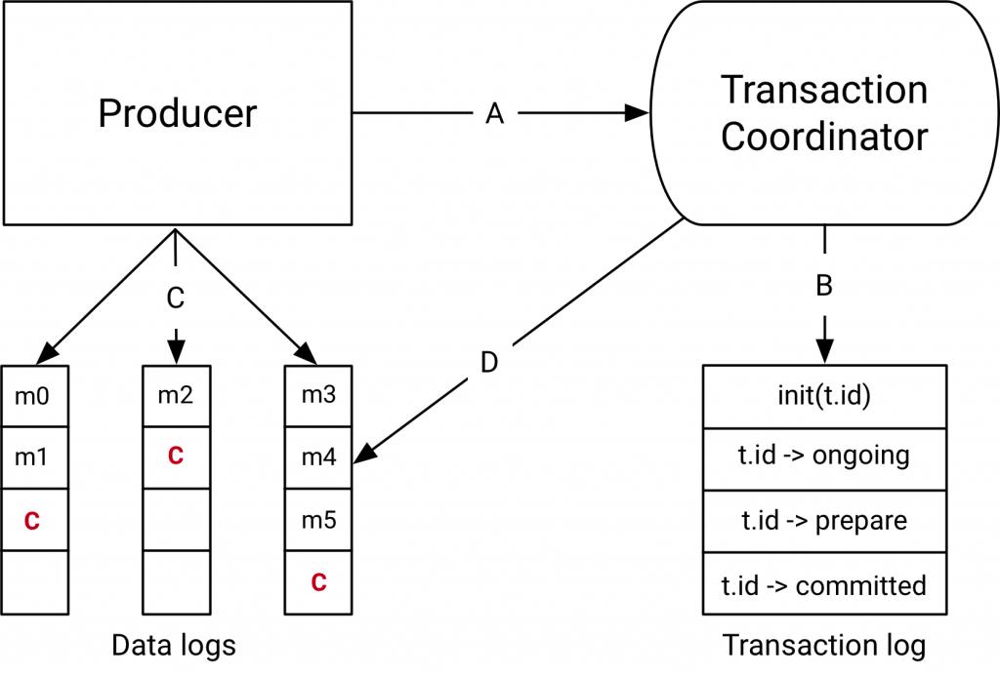

# Kafka
### Из каких компонентов состоит кластер?

1) **Producer**, **Consumer** - отправители и получатели сообщений
2) **Kafka Cluster** - сервер, содержащий брокеры кафки.
3) **Kafka Broker** - инстанс кафки, содержащий топики, и отвечающий за передачу сообщений
4) **Kafka Topic** - очередь сообщений
5) **Apache Zookeeper** - инструмент для координации. Следит за состоянием узлов и исходя из этого координирует 
чтение/запись. В 2024 планируется отказаться от Zookeeper в пользу встроенный в кафку KRaft.  

### Что есть transaction log?
Транзакции необходимы приложениям, которые читают данные из топика, модифицируют их и отправляют в другой топик. Данные
из топика источника должны прочитаться только в том случае, если обработанные данные записались в другой топик.

Общая схема устройства транзакции в kafka выглядит так:

Transaction log - системный топик кафки, который хранит состояние транзакций (начала, в обработке, закомичена). Каждый
transaction coordinator имеет свой transaction log. Необходим transaction log, чтобы coordinator мог восстановить
состояние зарегистрированных транзакций при падении брокера.

Transaction Coordinator находится внутри каждого kafka broker. При старте новой транзакции producer обращается в
coordinator для регистрации новой транзакции. Transaction coordinator регистрирует в своей памяти новую транзакцию с id
и дублирует эти данные в transaction log. Producer так же обновляет состояние транзакций. При падении брокера новый
координатор восстановит состояние транзакций из transaction log.

### Партиция. Что это такое? На что влияет? Кто есть лидер партиции?
Топики представляют собой не просто большую очередь для хранения сообщений. Каждый топик делится на **партиции**
(partition). Внутри партиции и находится очередь из сообщений. Механизм партиций необходим для распаралеливания
процесса. Ведь вместо того, чтобы читать всем из одной большой очереди, лучше разделить очередь на очереди поменьше
и читать уже **без конкурентного** доступа оттуда. Каждую партицию читает только один процесс получателя. Сообщения
между партициями разделяются на основе некоторых правил, упрощено можно считать, что сообщение может попасть в любую
из партиций и распределение между партициями равномерное. Таким образом, для высоконагруженных систем можно сделать
кучу партиций, поднять кучу инстансов сервисов и держать таким образом большую нагрузку.

Данные топиков хранятся в `.log` файлах. Под каждую партицию есть папка, где в `.log` файлах хранятся данные:
1) `00...0000.log` - файл для хранения offset (номера сообщения в партиции), position (байтовое смещение для сообщений),
   timestamp, message.
2) `00...0000.index` - файл для определения смещения для быстрого чтения. Хранит offset и position.
3) `00...0000.timeindex` - файл для определения смещения относительно времени, например для чтения данных за прошлую
   неделю. Хранит offset и timestamp.

Номер в названии файла - offset первого элемента в этом файле. При превышении файла по лимиту времени/места создаются
3 новых файла с новым названием, старые временно остаются и потом удалятся. Все 3 файла вместе называются сегментом. 
Закрытые сегменты хранятся на диске и не могут быть дополнены новыми записями. Удаление (при очистке) происходит 
посегментно, т.е. файл сегмента удаляется целиком.

Записи происходят исключительно в leader партицию, чтение (в общем случае) происходи тоже оттуда. Но можно настроить
чтение из НЕ лидер партиции. Когда лидер партиция умирает, выбирается ведущая партиция, которая займет ее место. 

### Какие политики очистки данных поддерживаются? Какая взаимосвязь с размером сегмента?
Кафка поддерживает две политики очистки данных:
1) Хранение до достижении определенного времени/размера
2) Очистка данных по ключу

Механизмы могут быть активированы одновременно или по отдельности. Хранение только по времени может быть неразумно,
поэтому поэтому лучше использовать по времени + по занятому месту. По умолчанию данные хранятся 7 дней без ограничения по
размеру.Настраиваться политика может на уровне брокера (применяется ко всем топикам) или на уровне топика (применяется
только к этому топику).

Однако стоит помнить про то, как хранятся данные в партиции, чтобы лучше понимать логику очистки данных:

Каждая партиция состоит из набора файлов, называемого сегментами. Новые сообщения записываются в
открытый/головной/активный сегмент. Закрытые сегменты хранятся на диске и не могут быть дополнены новыми записями.
Удаление происходит посегментно, т.е. файл сегмента удаляется целиком. Используется следующий алгоритм:
1) берется очередной закрытый сегмент
2) вычисляется разница между максимальным timestamp сообщений сегмента и текущим временем
3) эта разница сравнивается с настройкой и если она больше, то сегмент помечается к удалению
4) через некоторое время файлы удаляются отдельным потоком с файловой системы

### Что такое offset, где хранится
Offset - номер последнего сообщения из партиции, который прочитала данная consumer группа. Offset хранится в служебном
топике Kafka `__consumer_offsets`, где хранится offset для каждой пары партиция-группа (Partition, Group, Offset).

После обработки Consumer отправляет commit в `__consumer_offsets` и offset для данной группы меняется. Если consumer
упал, новый consumer в группе подгрузит offset из этой очереди.

Commit может быть:
1) Auto (гарантия at most once) - как только получил сообщения - сразу commit. Если упал на обработке, сообщение потеряно.
2) Manual (гарантия at least once) - commit вручную после того, как обработал сообщение.
3) Custom offset management (exactly once) - отказывается от служебного топика и хранит offset сами. Логику commit
   реализовываем тоже сами.

Offset может пропасть, если consumer долго не читал сообщения. На это влияет настройка `offsets.retention.minutes`,
по умолчанию 7 дней.

Если в `__consumer_offsets` нет записи по данной группе и партиции, то поведение задается настройкой 
`AutoOffsetReset = [latest, earliest, none]`:
1) `latest` - пропустить все старые записи и начать чтение с новых сообщений.  
2) `earliest` - прочитать все сообщения из топика, затем получать новые сообщения.  
3) `none` - выкинуть ошибку, если offset для получателя не задан.

### Rebalance. Что это такое? В каких случаях возникает?
Когда добавляется новая партиция, падает или появляется новый consumer - запускается процесс ребалансировки. Суть
процесса в том, чтобы заново распределить партиции по consumer.

В идеале, когда на каждую партицию есть по consumer. В таком случае при добавлении нового consumer ничего не произойдет,
поскольку одну партицию может читать максимум один consumer.

В любом другом случае есть два сценария:
1) Ребалансировка stop-the-world - все consumer останавливаются, мастер брокер заново распределяет партиции между
   consumer.
2) Кооперативная ребалансировка - consumer продолжают работу, партиции без чтецов распределяются по consumer.

### Какую функцию выполняет Zookeeper в кластере?
Zookeeper - инструмент для координации. Следит за состоянием узлов и исходя из этого координирует чтение/запись.
В 2024 году планируется отказаться от Zookeeper в пользу встроенный в кафку KRaft.

Задачи Zookeeper:
1) Хранение метаданных и конфигураций
2) Направление producer и consumer, в какую именно партицию и по какому адресу писать и читать данные
3) Определение для брокеров master партиции и выбор нового master в случае падения старого
4) Уведомление брокеров о новых партициях/топиках/брокерах/consumer

### Какие гарантии доставки предоставляет Kafka? Каким образом это достигается на каждом уровне?
Для начала параметры, которые помогают достичь разных гарантий доставки.

**acks** (гарантия доставки):
1) **0** - не ждет подтверждения отправки (самый быстрый способ, но могут теряться сообщения).  
2) **1** - ждет подтверждения только от мастер реплики (если мастер реплика упадет не успев передать данные - потеряем сообщение). 
3) **-1(all)** - подтверждения от мастер и ISR реплик (сообщения точно не потеряются).  

**enable.idempotence=[true|false]** - если true, то producer гарантирует, что сообщение будет отправлено 1 раз.

Гарантии доставки:
1) **at most once** - сообщение дойдет максимум 1 раз. Producer не повторяет отправку даже в случае ошибки. Достигается
путем `acks = [0,1]`
2) **at least once** - сообщение дойдет как минимум 1 раз. Достигается путем `acks = -1`. Producer может отправить 
сообщение еще раз, в случае если не получил положительного ответа. Однако положительный ответ может просто 
задерживаться.
3) **exactly once** - сообщение дойдет ровно 1 раз. Необходимо включить `enable.idempotence = true` и `acks = -1`. 
Достигается такая доставка тем, что кафка каждому пакету сообщений добавляет порядковый номер и хранит в реплицированном
логе, чтобы все брокеры могли определить, принимался такой пакет сообщений или нет.

### Какие гарантии порядка предоставляет Kafka?
В Kafka порядок может быть гарантирован только в пределах раздела (партиции). Это означает, что если сообщения были 
отправлены от производителя в определенном порядке, брокер запишет их в партицию, и все потребители будут читать из нее 
в том же порядке. Порядок на уровне топика **не** поддерживается.

### Сжатие данных в kafka
Для ускорения работы kafka может сжимать сообщения при отправке, хранить их и отправлять консюмеру. А он консюмер
будет автоматически их разжимать. Сжимать можно так же пакет сообщений для еще большего ускорения, однако стоит помнить,
что для такого пакета будет единый offset. Значит если упасть при его обработке, то при повторной обработке часть
сообщений обработается дважды.

### Zero Copy
Чтобы прочитать данные из log файла и отправить по сети нужно выполнить 4 копирования: между диском, памятью ядра, 
памятью контекста приложения и обратно в память ядра. Если никаких модификаций данных не выполняется, то некоторые
операционные системы поддерживают технологию Zero Copy, когда данные копируются напрямую из диску в память ядра и 
затем в сокет, минуя контекст приложения. Таким образом снимается нагрузка с ЦП по излишним копирования.

Так же повышает производительность страничный кеш (page cache), который хранится в ОЗУ. Kafka хранит там данные, которые
недавно прислал producer + данные, которые недавно читались. Таким образом можно сначала проверить в страничном кеше и 
если там есть искомые данные - не лезть на жесткий диск.

### Транзакции в Kafka
Producers поддерживают транзакции. Это означает, что при транзакционной отправке сообщения в несколько топиков 
транзакции делают гарантии, что сообщения отправится во все 3 топика или не отправится никуда (будут помечены как 
неотправленные и consumer не должны их читать). 

Для завершения транзакции необходимо вызвать commit или rollback у producer. 

Транзакции необходимы приложениям, которые читают данные из топика, модифицируют их и отправляют в другой топик. Данные
из топика источника должны прочитаться только в том случае, если обработанные данные записались в другой топик.

Общая схема устройства транзакции в kafka выглядит так:

Transaction log - системный топик кафки, который хранит состояние транзакций (начала, в обработке, закомичена). Каждый
transaction coordinator имеет свой transaction log. Необходим transaction log, чтобы coordinator мог восстановить
состояние зарегистрированных транзакций при падении брокера.

Transaction Coordinator находится внутри каждого kafka broker. При старте новой транзакции producer обращается в
coordinator для регистрации новой транзакции. Transaction coordinator регистрирует в своей памяти новую транзакцию с id
и дублирует эти данные в transaction log. Producer так же обновляет состояние транзакций. При падении брокера новый
координатор восстановит состояние транзакций из transaction log.

Порядок действий:
1) A: Producer регистрирует транзакцию в Transaction Coordinator
2) B: Producer оповещает координатора о стадии транзакции, координатор хранит это у себя в памяти и в transaction log 
в качестве бекапа
3) C: Producer пишет данные в топики
4) D: Transaction coordinator помечает записанные данные как aborted в случае неудачи, consumer должен иметь настройку 
`read_commited` чтобы не читать aborted данные