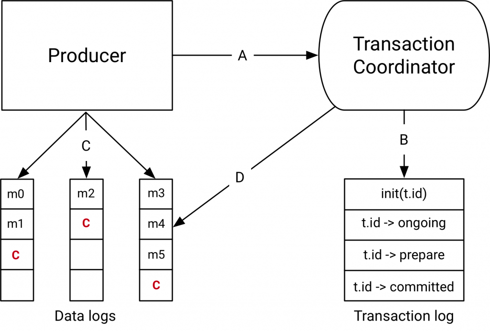

# Messaging

### Гарантии доставки сообщений
- **at-most-once**  

сообщение может быть доставлено 0 или 1 раз. Проще говоря сообщение может быть потеряно. Самый простой и эффективный 
способ доставки сообщений. Гарантий никаких. 

Отправитель просто отправляет сообщение, получатель его получает и может обработать или упасть. Переотправки не будет.

- **at-least-once** 

Сообщение может быть доставлено 1 и более раз. При ошибке доставки может быть предпринято несколько попыток отправить 
одно и то же сообщение. Поэтому могут возникнуть дубликаты, но потерянных сообщений быть не может. 

Отправитель отправляет сообщение, получатель его принимает и после обработки отправляет подтверждение. Если 
подтверждения нет долгое время, отправитель еще раз отправит сообщение. Если подтверждение потерялось, одно сообщение
может обработаться несколько раз.

- **exactly-once** 

Гарантированна доставка сообщения строго один раз. Именно этот вариант возникает по умолчанию в голове 
некоторых горе-программистов при упоминании любой системы обмена сообщениями. На практике же встречается достаточно 
редко.

Для этого способа нужно как-то синхронизировать отправителя и получателя, но тогда пропадают все плюсы messaging. Либо
придумывать бизнес-костыли.

### Transaction log
Транзакции необходимы приложениям, которые читают данные из топика, модифицируют их и отправляют в другой топик. Данные 
из топика источника должны прочитаться только в том случае, если обработанные данные записались в другой топик. 

Общая схема устройства транзакции в kafka выглядит так:

Transaction log - системный топик кафки, который хранит состояние транзакций (начала, в обработке, закомичена). Каждый
transaction coordinator имеет свой transaction log. Необходим transaction log, чтобы coordinator мог восстановить 
состояние зарегистрированных транзакций при падении брокера.

Transaction Coordinator находится внутри каждого kafka broker. При старте новой транзакции producer обращается в 
coordinator для регистрации новой транзакции. Transaction coordinator регистрирует в своей памяти новую транзакцию с id
и дублирует эти данные в transaction log. Producer так же обновляет состояние транзакций. При падении брокера новый
координатор восстановит состояние транзакций из transaction log.