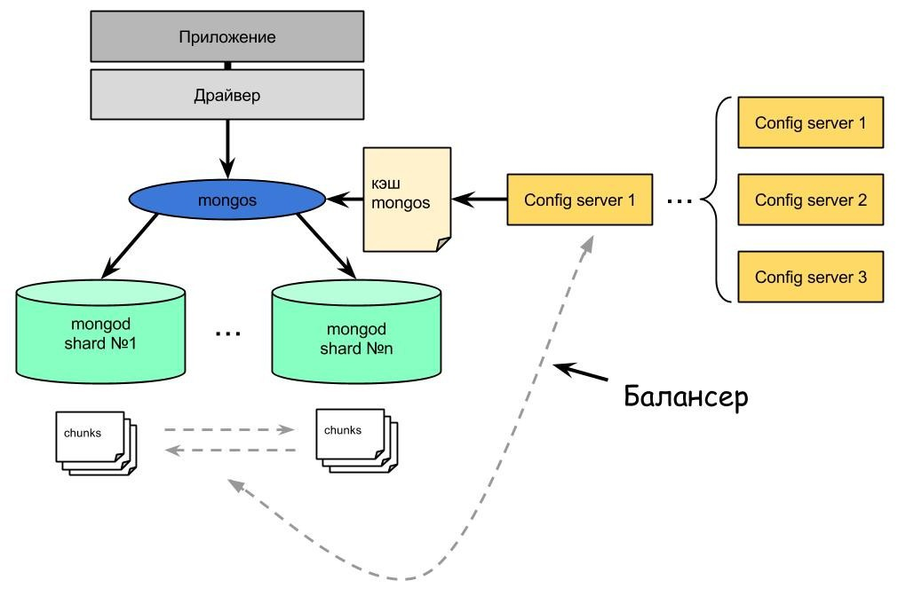
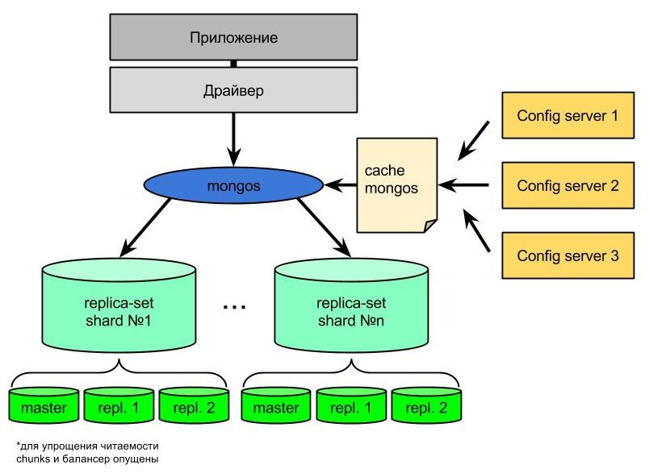
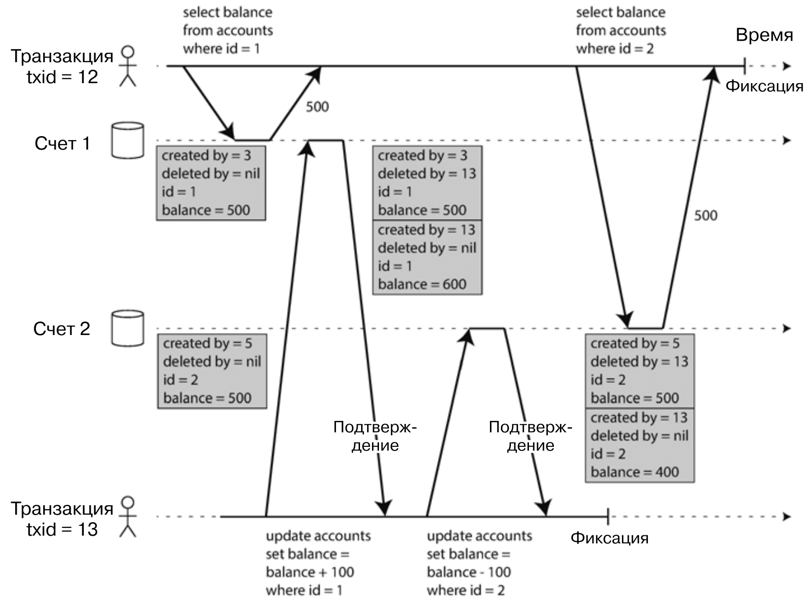

# MongoDB
### К какому типу NoSQL относится и в чем отличия от реляционных БД
MongoDB - документоориентированная БД. Упрощенно говоря, данные в ней хранятся в виде JSON документа, большинство связей
реализуются с помощью вложения документов. Благодаря этому мы получаем лучшую компоновку элементов (связанные данные 
хранятся рядом). Транзакции и связи с отношением "ко многим" реализованы не так хорошо. 

Storage Engine под капотом - LSM деревья. Используется движок WiredTiger и он потребляет много ОЗУ.

Отличия от реляционных БД:
1) Док-ая модель ближе к ООП разработке. Зачастую данные хранятся в виде JSON, что ближе к объектам в коде. Реляционная
   модель в свою очередь требует ORM фреймворков, чтобы записи в таблице можно было представить в виде объектов.
2) Док-ая модель имеет лучше локальность данных (все данные в одном документе), но у них плохо со связями. В особенности
   с many-to-one и many-to-many.
3) Док-ая модель более гибкая. Схема данных неявная и интерпритируется при чтении (scheme-on-read), в одной коллекции
   могут лежать данные разных форматов и узнаете вы это при чтении. Реляционная модель проверяет схему при записи
   и просто не даст записать неверные данные.

Основные доводы в пользу документной модели данных:
1) Гибкость схемы (Scheme on read)
2) Лучшая производительность в следствии локальности данных, не нужно тратиться на joins
3) Большая близость к применяемым структурам данных в коде

Доводы в пользу реляционной модели:
1) Лучшая поддержка соединений
2) Отсутствие гибкости схемы (Scheme on write)
3) Лучшая поддержка транзакций

**UPD**: транзакции в MongoDB реализованы, как утверждает документация MongoDB их даже можно использовать для финансовых
операций.

### Use cases когда стоит и не стоит использовать MongoDB
Правильные use cases использования:
1) Есть несколько БД, данные из которых нужно собирать в одно место. Плюсы MongoDB: Гибкая схема и компактность данных
2) В случаях, когда хранимые данные - типичные документы и отлично подходят под структуру БД
3) Хранение сложных данных с изменчивой и быстро развивающейся структурой
4) Хранение данных в высоконагруженных приложениях. MongoDB поддерживает легкое масштабирование

Use cases когда MongoDB лучше не использовать:
1) Когда данные сложны и имеют множество join связей
2) Когда не нужна гибкость данных

### JSON vs BSON
BSON - Binary JSON. По сути просто бинарное представление JSON, сделано для того, чтобы быстрее обрабатывать JSON в угоду
человеко читаемости. Так же BSON добавил новые типы полей для дат и двоичных данных.

На уровне кода мы все равно работаем с объектами. Драйвер MongoDB автоматически конвертирует данные в BSON и обратно.

### Replica Set
Replica Set — это кластер серверов MongoDB, реализующий механизм репликации master-slave и автоматическое переключение 
между ними. Это рекомендуемый механизм репликации от разработчиков MongoDB.

### CAP и MongoDB
MongoDB - CP или AP в зависимости от настроек Replica Set. 

По умолчанию все операции чтения происходят из master ноды. Таким образом мы всегда читаем гарантированно самые 
последние данные, ситуация CP.

Если включить чтение из slave нод, то консистентность чтения пострадает, но мы получим ситуацию AP.

### Write Concern
Write concern - политика уровня бд, которая задает кол-во подтверждений от инстансов БД, чтобы запись прошла успешно.

Какие есть варианты:
1) Majority - запись должна подтвердиться большинством инстансов
2) Number - запись должна подтвердиться Number инстансов

### Read concern
Read concern - политика уровня бд, которая задает кол-во инстансов из которых надо прочитать данные, перед там как 
вернуть результат запроса.

Какие есть варианты:
1) local - прочитать только из инстанса, куда пришло обращение
2) available - прочитать из нескольких инстансов, но меньше большинства
3) majority - прочитать из большинства инстансов
4) linearizable - похоже на majority, но ждет завершения паралельных процессов записи
5) snapshot - прочитать из большинства снапшотов инстансов

### MongoDB journal
MongoDB перед изменениями БД сначала записывает изменения в журнал. После сбоя при помощи журнала можно будет
восстановить данные, которые не успели перенестись на диск. 

### Transactions in MongoDB
Исторически в MongoDB была атомарна запись в 1 документ (не путать с коллекцией). Долгое время представители MongoDB 
говорили, что этого достаточно, так как можно спроектировать данные таким образом, чтобы в 1 документ попали все 
необходимые данные. 

Спустя какое-то время представили multi-document а затем и multi-shared транзакции. Их смысл в том, что транзакции
теперь можно проделывать с несколькими документами на разных репликах монги.

Гарантии транзакций в монге:
1) Атомарность. В случае ошибки записи изменения откатятся
2) Изоляция уровня read commited. То есть другие транзакции увидят только закомиченные данные. Но могут быть проблемы
при чтении данных из разных шардов при read concern `local`. Уровни изоляций можно менять при помощи write/read concern.

Влияние на производительность есть - существенно.

### Indexes
Такие же индексы, как и везде.

Типы индексов:
1) Signle Field Indexes - например по ID сотрудника
2) Single Field on a object Indexes - например по месту жительства сотрудника (объект location в документе)
3) Compound Indexes - сборные индексы по нескольким полям.

Атрибуты индексов:
1) Case insensitive
2) Hidden - для экспериментов, вместо удаления индекса можно его спрятать и посмотреть на производительность
3) Partial - индексируются документы которые удовлетворяют некоторому условию
4) Sparse - индексируются документы которые содержат индексируемое поле
5) TTL - удаляют документ из коллекции по прошествии какого-то времени
6) Unique - MongoDB не записывает документы с полем, значение которого уже встречается в БД

Стратегии использования:
1) ESR Rule - ключи в индексах должны быть расположены в особом порядке: сначала ключи, используемые для Equality, затем
Sorting, затем Ranging.
2) Если индекс составлен по всем полям, которые необходимы для запроса, то запрос обратится к индексу, вместо коллекции.
3) Индексы помогают в запросах с сортировках, так как индексы хранят данные упорядоченно.
4) Самые быстрые индексы - те, что помещаются в ОЗУ. Тогда движку не придется обращаться к диску

### Структура шардированного кластера
Без реплики все выглядит так:

**Чанк** - файл, хранящий информацию. Хранит документы в определенных диапазонах исходя из ключа шардирования. Ключ 
шардирования надо выбирать с умом, чтобы данные правильно поделились по чанкам.  
**ConfigServer** - хранит данные о шардах и понимает, в каком из них надо искать тот или иной документ.  
**Mongos** - кеширует данные ConfigServer, перенаправляет запросы клиентов, запуск процесса балансинга (перетаскивание 
чанков из шарда в шард).  

Шардированный кластер с репликами:

Все то же самое, но добавились реплики. Изменение данных всегда происходит через мастер ноду. Далее эти изменения 
асинхронно подтягиваются в реплики. 

### WiredTiger MVCC
Многоверсионное управление конкурентным доступом (multiversion concurrency control, MVCC) - механизм изоляций транзакций. 

В самом начале выполнения транзакция получает уникальный, монотонно возрастающий идентификатор (txid). При каждой записи 
транзакцией новые данные помечаются номером этой транзакции (поле created_by). Если транзакция удаляет строку, она 
записывается в поле deleted_by. Изменение строки == удаление старой строки и создание новой. В дальнейшем, когда уже 
никакая транзакция не обратится к удаленным данным, сборщик мусора БД очистит эти данные. 

Выполняя чтение транзакция использует идентификатор, чтобы понять, какие данные она может прочитать. Правило видимости
таковы:
1) В начале каждой транзакции БД определяет список выполняемых, но еще не зафиксированных транзакций. Все выполняемые
   этими транзакциями изменения игнорируются, даже если впоследствии будут зафиксированы.
2) Все операции записи выполненные транзакцией с более поздним txid игнорируются независимо от их результата.
3) Результаты всех остальных транзакций видны.

Другими словами версия объекта видна, если:
1) На момент начала читающей транзакции создавшая объект транзакция уже зафиксирована
2) Объект не помечен на удаление. Если помечен, то запросившая удаление транзакция не была зафиксирована на момент
   начала читающей транзакции