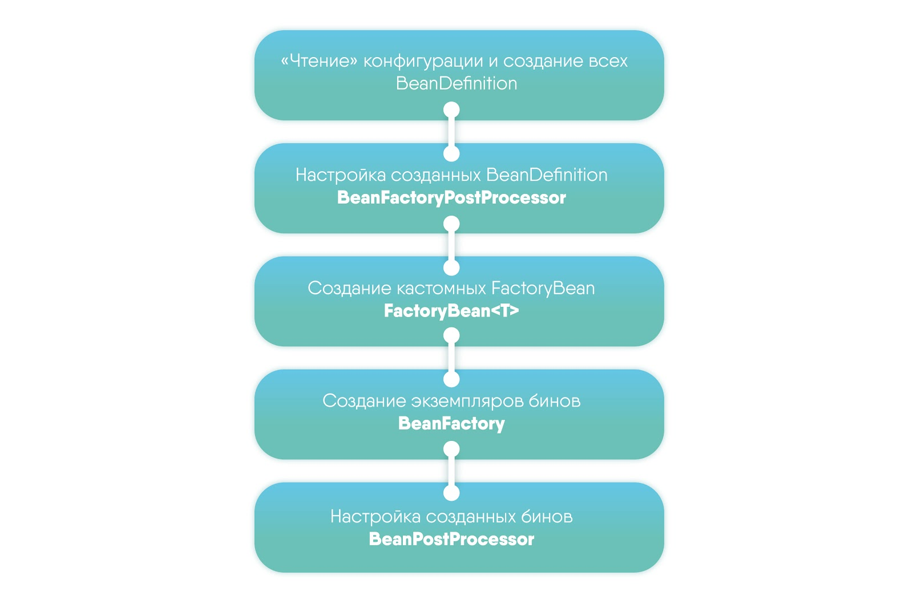
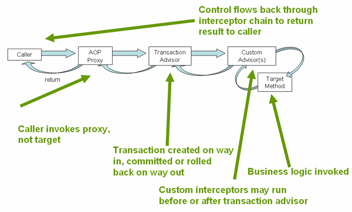

# Spring
### Spring IOC
В Spring Container реализован подход Inversion of Control (IOC), который так же часто называют Dependency Injection 
(DI). Подход заключается в том, что при создании объектов (точнее сказать бинов) необходимые зависимости для 
инициализации объекта предоставляет контейнер спринга. Данный процесс по сути является инверсией управления бина, так 
как контейнер самостоятельно контролирует его создание и размещение в контейнере.

### Spring Context
ApplicationContext по сути представляет собой IOC Container и является главным интерфейсом спринга. Внутри себя он 
хранит BeanFactory (более базовый контейнер). При помощи ApplicationContext можно настроить, каким образом будут 
создаваться бины (xml, annotations, configurations). 

Этапы формирования ApplicationContext:


Так же ApplicationContext представляет следующую функциональность:
1) Message и их интернационализация
2) Публикация и обработка event

### Bean creation lifecycle
1) Инициализируется контекст
2) BeanDefinitionReader читает и запоминает определение бинов 
3) BeanFactoryPostProcessor читает BeanDefinition -> как-то их изменяет
4) BeanFactory читает из BeanDefinitionReader все BeanPostProcessor и создает их
5) BeanFactory создает все остальные бины из BeanDefinitionReader
6) К каждому бину применяются все BeanPostProcessor beforeInitialization методы
7) У каждого бина вызывается init() метод
8) К каждому бину применяются все BeanPostProcessor afterInitialization методы
9) Готовый бин кладется в контейнер.

Важно, что синглтоны создаются сразу, а прототайпы по требованию (прототайпы в контейнер не складываются).

### Bean Scope

1) Singletone - один инстанс бина на IOC Container
2) Prototype - новый инстанс бина каждый раз по требованию (в контейнер не складываются)
3) Request - инстанс бина живет до тех пор, пока жив http request
4) Session - инстанс бина живет до тех пор, пока жива http сессия
5) Global session - инстанс бина живет до тех пор, пока жива глобальная http сессия, для portlet applications

### Трехфазовый конструктор
Идея в том, чтоб настроить Bean 

1) Java construct.
2) @PostConstruct / init method (BeanPostProcessor). Для обращения к механизмам Spring.
3) ApplicationContextListener. Может работать на этапах, когда контекст уже создан.

**Зачем нужен init метод**  
Если мы обратимся к спринговым компонентам в контроллере, то получим NPE. BeanInjection происходит после создания 
работы контроллера. А в init method все зависимости спринга будут на месте.

### ApplicationContextListener  
Данный интерфейс позволяет слушать ApplicationContext и как-то реагировать на его lifecycle events.
Его events в натуральном порядке:

1) ContextStartedEvent
2) ContextRefreshedEvent
3) ContextStoppedEvent
4) ContextClosedEvent

### BeanFactoryPostProcessor
Позволяет повлиять на BeanFactory после его инициализации.
Например можно поправить определенный BeanDefinition.

Схема работы такая:

1) BeanDefinitionReader читает XML -> генерит BeanDefinition
2) BeanFactoryPostProcessor читает BeanDefinition -> как-то их изменяет МЫ ТУТ
3) BeanFactory читает BeanDefinition -> кладет бины в IoC container

### Зачем BeanPostProcessor нужно before и after initialization
before передаст измененный объект в init метод, иногда это нежелательно

### Обновление Prototype в Singletone
```java
class abstract Singleton {
    public abstract Prototype getPrototype();
}

@Config
class JavaConfig {
    @Bean
    @Scope("prototype")
    public Prototype prototype() {
        return prototype;
    }
    
    @Bean
    public Singleton singleton() {
        return new Singleton() {
            @Override
            public Prototype getPrototype() {
                return prototype();
            }
        };
    }
}
```

### ApplicationContextInitilizer
Отрабатывает, когда контекст только начинает инициализацию, еще ничего не создано

### Параметры Transactional
`propagation` - способ "распространения" транзакций

Выделяется следующие способы:
1) **MANDATORY** - если есть текущая активная транзакция - выполняется в ней, иначе выбрасывается исключение
2) **NESTED** - выполняется внутри вложенной транзакции, если есть активная, если нет активной - то аналогично REQUIRED
3) **NEVER** - выполняется вне транзакции, если есть активная - выбрасывается исключение
4) **NOT_SUPPORTED** - выполняется вне транзакции - если есть активная, она приостанавливается
5) **REQUIRED** - (значение по умолчанию) - если есть активная, то выполняется в ней, если нет, то создается новая транзакция
6) **REQUIRES_NEW**- всегда создается новая транзакция, если есть активная - то она приостанавливается
7) **SUPPORTS** - если есть активная - то выполняется в ней, если нет - то выполняется не транзакционно

Правила управления откатом:
1) noRollbackFor и noRollbackForClassName - определяет исключения, при которых транзакция НЕ будет откатана
2) rollbackFor и rollbackForClassName - определяет исключения, при которых транзакция БУДЕТ откатана


### Как работает @Transactional spring
Transactional работает по принципу Spring AOP. То есть создается класс Proxy, который перехватывает все обращения. В 
этом proxy и производится необходимая для транзакций работа.

Два основных класса: 
1) `TransactionAttributeSource` - определяет pointcut для транзакции, то есть места, где необходимо встроить proxy
2) `TransactionInterceptor` - определяет advice для транзакций, то есть proxy код обслуживающий транзакцию

`TransactionInterceptor` под капотом делает по сути следующее:
1) получаем соединение/транзакцию 
2) выполняем необходимые запросы 
3) если не было ошибок - выполняем commit
4) Если все-таки была ошибка - откатываем изменения 

Схема работы транзакций:


1) Caller вызывает метод
2) Вызов перехватывает AOP Proxy
3) TransactionInterceptor создает транзакцию
4) Запускается CustomInterceptor (если есть) до транзакции
5) **Выполняется вызываемый метод**
6) Запускается CustomInterceptor (если есть) после транзакции
7) TransactionInterceptor делает commit или rollback
8) AOP Proxy возвращает результат Caller

Ну и вишенка - самый частый вопрос с собесов:
Будет ли при вызове test2 из метода test1 создана новая транзакция?
```java
@Service
public class ServiceTest{
  @Transactional
  public void test1 {
      test2();
  }

  @Transactional(propagation = Propagation.REQUIRES_NEW)
  public void test2() {
  }
}
```

Ответ: нет, так как AOP Proxy применяется только для вызова метода извне. Так как test1 вызывает test2 и это метод
того же класса, AOP Proxy вызван не будет.

### Генерация proxy
Для классов, имплементирующих интерфейс, прокси генерируется на основе JDK dynamic proxies. Создается прокси для каждого
интерфейса. В остальных случаях, используется CGLib, который генерирует прокси на основе наследования от target класса.

### BeanPostProcessor & BeanFactoryPostProcessor
Идея BeanPostProcessor в том, чтоб реализовать трехфазовый конструктор.

1) Java construct.
2) @PostConstruct / init method (BeanPostProcessor). Для обращения к механизмам Spring.
3) ApplicationContextListener. Может работать на этапах, когда контекст уже создан.

BeanFactoryPostProcessor позволяет повлиять на BeanFactory после его инициализации. Например можно поправить 
определенный BeanDefinition. Схема работы такая:
1) BeanDefinitionReader читает XML -> генерит BeanDefinition
2) BeanFactoryPostProcessor читает BeanDefinition -> как-то их изменяет **МЫ ТУТ**
3) BeanFactory читает BeanDefinition -> кладет бины в IoC container

