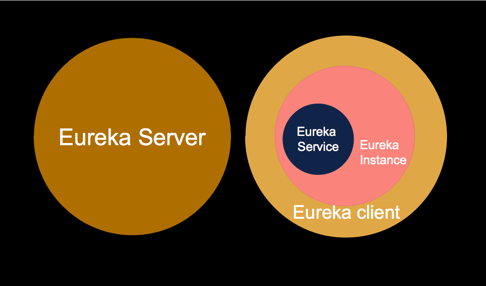
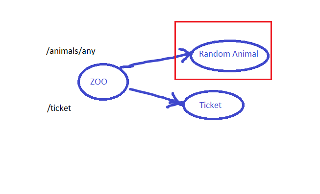

# Spring Cloud
### Что это
Spring Cloud позволяет не реализовывать некоторые распределенные паттерны и часто используемые вспомогательные сервисы.
По аналогии со Spring Boot он позволяет из коробки развернуть и донастроить спринговый сервис, который будет решать
поставленные задачи. 

Предлагаемые сервисы:
- Distributed/versioned configuration
- Service registration and discovery
- Routing
- Service-to-service calls
- Load balancing
- Circuit Breakers
- Global locks
- Leadership election and cluster state
- Distributed messaging
- etc

### Spring Cloud Config
Данный инструмент позволяет реализовать Config Server, который будет подтягивать конфиги из git репы. Сервисы будут 
подтягивать конфигурацию с данного Config Server.

Config Server позволяешь шифровать и дешифровать значения. Таким образом в нем можно хранить зашифрованные sensitive
данные, которые сервис дешифрует при получении.

### Spring Cloud Service discovery
Данный инструмент решаем проблему service discovery, когда есть единый сервер (в нашем случае Eureka), который хранит
url до API всех зарегистрированных сервисов. Сервисы в нем регистрируются, раз в 30 секунд отправляют heartbeat и 
получают данные о расположении остальных API. 

Сущности в Eureka:
1) Eureka Client - микросервис, готовый работать с Eureka.
2) Eureka Instance - инстанс микросервиса (может быть несколько)
3) Eureka Service - когда инстанс регистрируется в Eureka, он регистрирует Eureka Service с каким-то ID
4) Eureka Server - непосредственно сервер Eureka, хранящий данные о сервисах



Когда клиент регистрируется в Eureka, он предоставляет метаданные о себе - такие как хост, порт, URL—адрес health check, 
домашняя страница и другие сведения. Eureka получает сообщения о heartbeat от каждого экземпляра, принадлежащего службе. 
Если heartbeat завершается сбоем по настраиваемому расписанию (по умолчанию каждые 30 сек), экземпляр обычно удаляется 
из реестра. У клиентов есть кэш регистраций других сервисов в Eureka, поэтому им не нужно обращаться к реестру для 
каждого запроса к сервису.

Service считается доступным к вызовам только в том случае, если instance, server и client имеют одинаковые данные в кеше.
Для этого может понадобиться 3 вызова heartbeat.

Eureka Instances могут быть расположены в разных зонах (например географических), если указать необходимые конфигурации,
то Eureka будет сначала отправлять в необходимые сервисы той же зоны, что и запрашивающий сервис. И только потом в 
другие зоны, если первый вызов неудачный.

Eureka Client - refreshable бины, так что пропертя клиента можно изменить и если это произойдет, эти инстансы 
снимутся с регистрации в Eureka.

### Circuit Breaker
Допустим у нас есть 3 сервиса. Пользователь обращается в браузере к Zoo, а тот в свою очередь к Random Animal и Ticket:


Если в какой-то момент времени сервис Random Animal упадет и не будет отвечать сразу, а с какой-то задержкой, то 
все его запросы могут занять весь пул потоков сервиса Zoo. И в таком случае уже сервис Zoo не сможет обрабатывать новые
запросы. В таком случае поможет паттерн **Circuit Breaker**. 

У паттерна есть две реализации: Hystrix и Resilience4j. Hystrix перестали поддерживать, так что лучше использовать 
Resilience4j.

Суть паттерна в том, что сервис Zoo замечает падение сервиса Random Animal (отслеживает удачные/неудачные запросы) и
если этот сервис падает, то запросы в него на самом деле не уходят. Вместо запросов в упавший сервис используется 
шаблонный ответ, заготовленный заранее. Все происходит автоматически, программисту нужно только пометить опасные методы 
и задать настройки.

Параметры Circuit Breaker:
1) **slidingWindowSize** - сколько последних вызовов сервиса отслеживать
2) **failureRateThreshold** - какой процент упавших вызовов должен быть для закрытия вызовов
3) **slowCallDurationThreshold** - если сервис отвечает дольше этой настройки, вызов считается неудачным
4) **waitDurationInOpenState** - сколько ждать перед тем, как проверить, что сервис снова работает

### Sleuth
Spring Sleuth подставляет trace_id и span_id в хедеры запроса, которые позже выводит в логи:

```
DATE TIME  INFO [Application name,4e30f7340b3fb631,4e30f7340b3fb631,false] 12516 
  --- [nio-8080-exec-1] c.b.spring.session.SleuthController : Hello Sleuth
```

Sleuth добавляет то, что в квадратных скобках [application name, traceId, spanId, export]:
1) Application name – Пропертя spring.application.name
2) TraceId – Каждому http запросу представляется trace_id который будет помечать его среди всех процессов и межсервисных взаимодействиях
3) SpanId – Внутри одного сервиса или потока запрос будет помечаться отдельным SpanId. 
4) Export – true|false - отправляются ли данные в Zipkins, средство для аналитики таких логов.

При помощи trace_id можно отслеживать весь путь http запроса от фронта к мидлу и обратно. Span_id позволяет 
просматривать часть пусти http запроса в рамках одного сервиса или потока. Уникальный span_id можно присвоить вручную.

trace_id и span_id проставляются в хедерах запроса. При общении между сервисами все стандартные инструменты (Feign, 
RestTemplate, etc) автоматически проставляют эти хедеры. Достаточно, чтобы два сервиса использовали spring + sleuth. 
Если какой-то из сервисов написан на другом языке или не написан на spring + sleuth, то данные trace_id и span_id можно
вытащить самостоятельно из хедеров запроса.