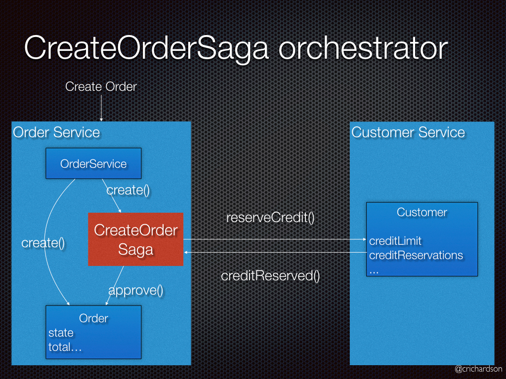

# Распределенные паттерны
Паттерны для распределенных систем

- [CQRS](#cqrs)
- [SAGA](#saga)
- [Kappa](#kappa)
- [2PC](#2pc)

## CQRS
SQRS - паттерн, разделяющий операции записи (команды) и чтения (запросы). Разделение может быть разное: начиная с
интерфейсов в одном сервисе, заканчивая физическим разделением разных сервисов по разным машинам, используя репликацию
БД.

Когда использовать: очень высоконагруженные приложения (нагруженные на работу с БД), где можно разделить операции
на команды и запросы (это не всегда возможно и хорошо ложится на бизнес процессы). Не стоит применять CQRS без явной на
то необходимости, иначе это приведет к проблемам.

Преимущества:
1) Независимое масштабирование и оптимизация операций чтения и записи
2) Для операций чтения можно применить оптимизированную схему данных или БД. Например записывать в реляционную БД, а
   ее репликой использовать нереляционную
3) Удобнее настраивать безопасность на изменение и чтение данных
4) Разделение проблем при чтении и записи, которые можно решать отдельно

Недостатки:
1) Сложность
2) Проблемы репликаций
3) Сложно придерживаться, многие операции записи могут читать данные и наоборот

## Saga
Saga - шаблон управления согласованностью в сценариях распределенных транзакций (упрощенно говоря).

Допустим у нас есть несколько сервисов со своими БД и в несколько БД нужно согласованно записать какие-то данные.
В некоторые случаях распределенные транзакции недоступны из-за выбора БД или из-за железа, в таком случае
можно использовать сагу.

Сага разделяет единую бизнес транзакцию на маленькую локальную транзакцию для каждого сервиса. Каждая локальная
транзакция публикует event, на основе которого определяется, стоит ли продолжать транзакцию дальше, либо выполнить
_компенсирующие транзакции_ для невелирования изменений. Откатить предыдущие транзакции сага не может, поскольку
они уже закомиченны.

Существует два типа саги: хореографическая и на основе оркестратора.

**Хореографическая сага** - каждая транзакция публикует событие, которые запускает транзакции в других сервисах:  

В интернет магазине с использованием саги, основанной на хореографии, создание заказа будет включать следующие шаги:

1) Order Service создает Order в статусе pending и публикует событие OrderCreated
2) Customer Service получает событие и пытается зарезервировать кредит для заказа. После чего публикует одно из двух
   событий: CreditReserved или CreditLimitExceeded
3) Order Service получает событие и изменяет состояние заказа в approved или cancelled

Плюсы:
1) Хорошо подходит для простых рабочих процессов, требующих нескольких участников и не требующих логики координации.
2) Не требует дополнительной реализации и обслуживания оркестратора.
3) Не представляет ни одной точки неудачи, так как обязанности распределяются между участниками саги.

Минусы:
1) Рабочий процесс может запутаться при добавлении новых шагов, так как сложно отследить, какие участники саги слушают
   какие команды.
2) Тестирование интеграции сложно, так как для имитации транзакции должны выполняться все службы.

**Сага на основе оркестратора** - оркестратор говорит участникам, какие транзакции должны быть запущены.  

В интернет магазине с использованием саги, основанной на оркестровке, создание заказа будет включать следующие шаги:

0) Оркестратором тут является OrderService.
1) Order Service создает Order в статусе pending и создает CreateOrderSaga
2) CreateOrderSaga отправляет команду ReserveCredit в Customer Service
3) Customer Service пытается зарезервировать кредит для заказа и отправляет назад ответ
4) CreateOrderSaga получает ответ и отправляет ApproveOrder or RejectOrder команду в Order Service
5) Order Service изменяет состояние заказа в approved или cancelled

Плюсы:
1) Хорошо подходит для сложных рабочих процессов с участием большого количества участников или новых участников,
   добавленных с течением времени
2) Не вводит циклических зависимостей, так как оркестратор в одностороннем порядке зависит от участников саги.
3) Участникам Saga не нужно знать о командах для других участников. Четкое разделение задач упрощает бизнес-логику.

Минусы:
1) Требуется реализация логики оркестратора.
2) Существует дополнительная точка сбоя, так как оркестратор управляет полным рабочим процессом.

## Kappa
Kappa - архитектурный шаблон для real-time обработки большого количества данных из разных источников. Состоит из 4
компонентов:
1) Источники данных (лог файлы, датчики, API's, etc)
2) Любой брокер сообщений или NoSQL база данных, в которую собираются данные
3) Сервис-обработчик данных из предыдущего шага
4) Конечная база (зачастую OLAP) в которую обработанные данные собираются для хранения

## 2PC
2PC (Two-Phase Commit) - это распределенный паттерн проектирования, который используется для обеспечения согласованности
данных в распределенных системах. Он состоит из двух фаз: подготовительной и финальной.

В подготовительной фазе координатор системы отправляет запрос на изменение данных всем участникам транзакции, которые
должны подтвердить возможность выполнения операции. Если все участники готовы к выполнению операции, то начинается
финальная фаза. В рамках этой фазы на всех нодах начинается транзакция и удерживается с помощью блокировок и других
инструментов.

В финальной фазе координатор отправляет команду на commit транзакции всем участникам, и если все операции выполняются
успешно, то транзакция завершается успешно. Если же хотя бы один участник не может выполнить операцию, то транзакция
откатывается и данные возвращаются к исходному состоянию.

Этот паттерн обеспечивает согласованность данных в распределенных системах, где данные могут быть изменены в разных
местах одновременно. Он широко применяется в системах электронной коммерции, банковских операциях и других приложениях,
где необходимо обеспечить целостность данных.

Разница с Saga в том, что 2PC использует блокировки для удержания транзакции, а Saga отдельные запросы с другой
транзакцией, которая откатит первую.