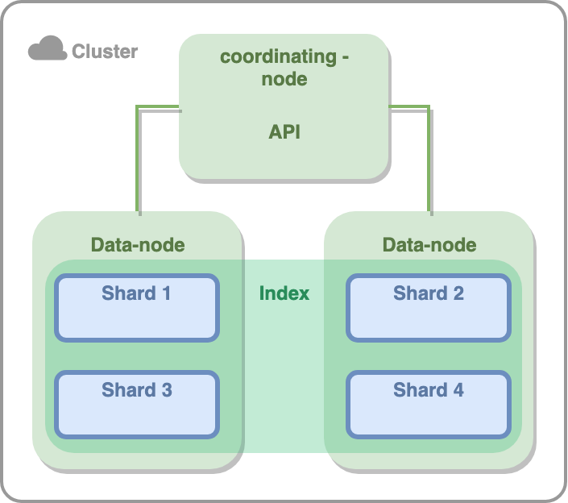

# ElasticSearch 

- [Преимущества и недостатки ElasticSearch](#преимущества-и-недостатки-elasticsearch)
- [По какому протоколу общается клиент с сервером?](#по-какому-протоколу-общается-клиент-с-сервером)
- [Как Elastic хранит данные](#как-elastic-хранит-данные)
- [Elastic nodes](#elastic-nodes)
- [Примеры запросов](#примеры-запросов)
- [Состояния кластера](#состояния-кластера)
- [Query vs Filter contexts](#query-vs-filter-contexts)
- [Elastic Mapping](#elastic-mapping)
- [Elastic concurrency](#elastic-concurrency)

## Преимущества и недостатки ElasticSearch
Достоинства:
+ Легкая горизонтальная масштабируемость
+ Гибкая схема данных 
+ Полнотекстовый поиск и гибкий поиск по полям

Недостатки:
- Временной лаг между добавлением данных и их доступностью для поиска
- Нет ACID транзакций
- Недостаточная надежность хранения данных (AP система)

Из всего этого можно сделать вывод, что ElasticSearch это поисковый движок и ее не стоит использовать как основную
базу для хранения данных.

Использовать ElasticSearch стоит в случаях:
1) Нужен полнотекстовый поиск.
2) Необходим гибкий поиск по всем полям.
3) Нужно собрать данные из разных источников.

## По какому протоколу общается клиент с сервером?
Клиент с сервером может общаться по HTTP или ES Native протоколу. Лучше использовать первый, как более понятный и 
общепринятый. Второй обычно используется для больших объемов данных.

Компоненты внутри Elastic кластера общаются с помощью ES Native протокола.

## Как Elastic хранит данные
Самая большая единица данных - **index**. Это аналог базы данных из реляционных БД. Внутри индекса могут храниться 
разные типы (**types**), это аналог таблиц из реляционных БД. Данные в типе разбиваются по шардам (**shards**), это способ 
партицирования в эластике. У каждого шарда есть **реплика** (может быть даже не одна). Таким образом, верхнеуровнего
все выглядит так:


Кол-во всех составляющих (кроме кластера) можно настроить, что позволяет гибко масштабировать кластер эластика.

## Elastic nodes
Все шарды хранятся на нодах. Ноды в эластике бывают следующих типов:
1) Coordination node - ноды куда прилетают все запросы. Такая нода парсит запросы, приводит их к определенному виду и 
отправляет в data node. По этой причине таким нодам необязательно иметь большой объем hdd памяти, но нужен хороший 
процессор и ОЗУ. 
2) Data node - непосредственно нода, которая хранит и проводит поиск по данным. В идеале иметь SSD.
3) Master node - управляет топологией кластера: создает новый индекс, выделяет и распределяет шарды, перемещает их и 
объединять в случае необходимости. Мастер нода имеет реплики, каждая хранит номер версии кластера и в случае
выхода из строя мастер ноды, новый мастер выбирается исходя из номера версии. Новый мастер назначается голосованием по
кворуму.

## Примеры запросов
```bash
# Добавим документ c id 1 типа type в индекс index.
# ?pretty указывает, что вывод должен быть человеко-читаемым.
curl -XPUT "$ES_URL/{index}/{type}/1?pretty" -d'
{
  "title": "test title",
  "content": "test content",
  "tags": [
    "test",
    "elastic_test"
  ],
  "published_at": "2023-08-24T10:14:42+00:00"
}'

# извлечем документ по id типа type из индекса index
curl -XGET "$ES_URL/{index}/{type}/{id}/_source?pretty"

# Можно выбрать определенные поля
curl -XGET "$ES_URL/{index}/{type}/{id}?_source=field1?pretty"
```

## Состояния кластера
Состояния может быть три:
- Зеленое: все primary и replica шарды в строю
- Желтое: все primary шары в строю, но некоторые реплики не отвечают
- Красное: Как минимум один primary шард не в строю

## Query vs Filter contexts
Elastic поддерживает два контекста при запросе: query context и filter context. Внешне выглядит так, что мы зачем-то
разделили условие на две части:
```bash 
GET /_search
{
  "query": { 
    "bool": { # QUERY CONTEXT 
      "must": [
        { "match": { "title":   "Search"        }},
        { "match": { "content": "Elasticsearch" }}
      ],
      "filter": [ # FILTER CONTEXT
        { "term":  { "status": "published" }},
        { "range": { "publish_date": { "gte": "2015-01-01" }}}
      ]
    }
  }
}
```

На основе Query считается relevance score, который будет маркировать насколько результаты хорошо подходят query context.
По этой причине Query не кэшируются и могут выполняться дольше. Filters в свою очередь кэшируются, могут выполняться
быстрее и считать score им нет необходимости из-за бинарного результата фильтрации.

Queries используются:
1) Для полнотекстового поиска
2) Где результат фильтрации определен релевантностью (relevance score)

Filters используются:
1) Когда результат фильтра бинарен: да/нет
2) Для запросов по точным значениям (выпадашки в фильтрах)

Чтобы оптимально построить поисковой запрос:
1) Пользуйтесь фильтрами, при правильной фильтрации до query context дойдет минимальное количество необходимых данных
и запрос обработается быстрее
2) Избегайте wildcards (*), в особенности leading wildcards (*clausetext)

## Elastic Mapping
Mapping можно определить для типа или для индекса (в таком случае применяется ко всем типам данного индекса). Mapping
напоминает определение таблицы в реляционных БД, там перечисляются поля, их типы, дефолтные значения и другие метаданные.

```
curl -XPOST 'http://localhost:9200/test' -d '{
    "settings" : {
        "number_of_shards" : 1
    },
    "mappings" : {
        "type1" : {
            "properties" : {
                "field1" : { "type" : "string" }
            }
        }
    }
}'
```

Есть два типа mapping: explicit и dynamic. Если мы сохраняем объект с неизвестным для mapping полем, то explicit 
mapping проигнорирует это поле. Elastic его сохранит, но поиск по нему будет невозможен. Dynamic mapping проиндексирует
это поле автоматически, определение типа поля, как правило, работает довольно сносно.

Изменить маппинг существующих полей невозможно, только создавать новый индекс с новым маппингом и реиндексировать 
данные. Это очень дорогая операция, если данных много. Если реиндексировать не вариант, можно создать новое поле с 
новым типом данных, но это костыль. 

Добавление нового поля при динамическом маппинге не составляет проблем, новое поле добавится в маппинг автоматически. 
При explicit маппинге нужно будет его обновить специальным запросом:

```
PUT indexname/_mapping/mytype 
{
  "properties": {
    "dateAdded": {
       "type": "date",
       "format": "dateOptionalTime"
    }
  }
}
```

## Elastic concurrency
Elastic реализует optimistic locking, в противовес реляционным БД которые реализуют pessimistic locking. Такой подход
позволяет эластику быть более производительным.

Elastic присваивает каждому документу номер. Каждая операция изменения сначала читает и запоминает этот номер, проводит
изменение документа и при сохранении документа сверяет этот номер. Если номер остался тем же, изменение подтверждаются,
номер документа увеличивается. Если номер стал другим, изменения не применяются, приложению возвращается ошибка и 
приложение должно понять, что с этой ошибкой делать. Попробовать изменить документ еще раз, прочитать новое значение
или отдать ошибку пользователю.