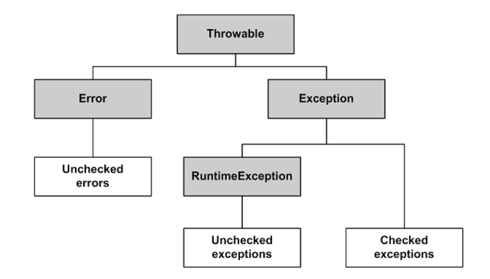

# Java CORE

- [Heap и Stack память в Java](#heap-и-stack-память-в-java)
- [Чем различаются JRE, JVM и JDK?](#чем-различаются-jre-jvm-и-jdk)
- [Модификаторы доступа](#модификаторы-доступа)
- [Нюансы статических методов](#нюансы-статических-методов)
- [Почему String неизменяемый и финализированный класс?](#почему-string-неизменяемый-и-финализированный-класс)
- [String.intern()](#stringintern)
- [Dynamic and Static class loading](#dynamic-and-static-class-loading)
- [equals и hashcode](#equals-и-hashcode)
- [Иерархия исключений](#иерархия-исключений)
- [Виды ссылок в Java](#виды-ссылок-в-java)
- [Сериализация](#сериализация)
- [Dynamic proxies](#dynamic-proxies)
- [Нововведения разных версий Java](#нововведения-разных-версий-java)

## Heap и Stack память в Java
**Heap** (куча) используется Java Runtime для выделения памяти под объекты и классы. Создание нового объекта (**и его 
примитивных полей**) также происходит в куче. Это же является областью работы сборщика мусора. Любой объект (всё, что 
явно или неявно создаётся при помощи оператора new) хранится в куче.

**Stack** (стек) это область хранения данных также находящееся в общей оперативной памяти (RAM). Всякий раз, когда
вызывается метод, в памяти стека создается новый блок (frame), который содержит примитивы и ссылки на другие объекты из
переменных метода. Размер стековой памяти намного меньше объема памяти в куче.

## Чем различаются JRE, JVM и JDK?
**JVM**, Java Virtual Machine (Виртуальная машина Java) — основная часть среды выполнения Java (JRE). 
Виртуальная машина Java исполняет байт-код Java, предварительно созданный из исходного текста Java-программы 
компилятором Java. JVM может также использоваться для выполнения программ, написанных на других языках программирования.

**JRE**, Java Runtime Environment (Среда выполнения Java) - минимально-необходимая реализация виртуальной 
машины для исполнения Java-приложений. Состоит из JVM и стандартного набора библиотек классов Java.

**JDK**, Java Development Kit (Комплект разработки на Java) - JRE и набор инструментов разработчика приложений на языке 
Java, включающий в себя компилятор Java, стандартные библиотеки классов Java, примеры, документацию, различные утилиты.

## Модификаторы доступа
**private**: члены класса доступны только внутри класса.

**default**: видимость класса/членов класса только внутри пакета. Является модификатором доступа по умолчанию - 
специальное обозначение не требуется.

**protected**: члены класса доступны внутри пакета и в наследниках.

**public**: класс/члены класса доступны всем.

Во время наследования возможно изменения модификаторов доступа в сторону большей видимости 
(для поддержания соответствия принципу подстановки Барбары Лисков).


## Нюансы статических методов
**Может ли статический метод быть переопределён или перегружен?**:  
Перегружен - да. Всё работает точно так же, как и с обычными методами - 2 статических метода могут иметь одинаковое имя,
если количество их параметров или типов различается.

Переопределён - нет. Выбор вызываемого статического метода происходит при раннем связывании (на этапе компиляции, а не
выполнения) и выполняться всегда будет родительский метод, хотя синтаксически переопределение статического метода -
это вполне корректная языковая конструкция.

**Могут ли нестатические методы перегрузить статические?**:  
Да. В итоге получится два разных метода. Статический будет принадлежать классу и будет доступен через его имя, а
нестатический будет принадлежать конкретному объекту и доступен через вызов метода этого объекта.

**Можно ли объявить метод абстрактным и статическим одновременно?**: 
Нет. Модификатор abstract говорит, что метод будет реализован в другом классе, а static наоборот указывает, что этот
метод будет доступен по имени класса.

## Почему String неизменяемый и финализированный класс?
- Пул строк возможен только потому, что строка неизменяемая, таким образом виртуальная машина сохраняет больше
  свободного места в Heap, поскольку разные строковые переменные указывают на одну и ту же переменную в пуле.
- Неизменяемость позволяет избежать необходимости в синхронизации

## String.intern()
Метод intern() используется для сохранения строки в пуле строк или получения ссылки, если такая строка уже
находится в пуле.

Таким образом:
```java
class InternExample {
    public void internShowCase() {
      new String("Hello") == new String("Hello") // false
      new String("Hello").intern() == new String("Hello").intern() // true
    }
}
```

## Dynamic and Static class loading
Джава лениво загружает необходимые ей классы в рантайме. Все классы изначально скомпилированы, но чтобы не держать
в памяти (в стеке) данные обо всех классах, джава подгружает только те классы, которые ей необходимы для выполнения
кода.

Перед стартом приложения джава смотрит Main класс, загружает его и все классы, что используются в Main. Далее она
переходит в используемые классы и делает то же самое. Это происходит еще во время этапа компиляции и называется Static
class loading.

Динамическая загрузка классов нужна, чтобы подгрузить классы, которые статическая загрузка найти не смогла. Например,
какое-то модульное приложение, в рантайм к которому подложили новый жарник. Особенно остро стоит вопрос, если
приложение statefull и не хочется сбрасывать состояние при перезапуске. Динамическая подгрузка происходит с помощью
ClassLoader:

```java

public class MainClass {

    public static void main(String[] args) {
        ClassLoader classLoader = MainClass.class.getClassLoader();

        try {
            Class dynamicClass = classLoader.loadClass("ru.example.MyDynamicClass");
            System.out.println("MyDynamicClass.getName() = " + dynamicClass.getName());
        } catch (ClassNotFoundException e) {
            e.printStackTrace();
        }
    }
}
```

Динамическая перезагрузка класса - тема отдельная и сложная. Перед загрузкой класса ClassLoader проверяет, а не был ли
еще загружен этот класс. Если был, то перезагрузка не происходит. В качестве обходного пути можно использовать
другой ClassLoader отличный от первого, но подгруженный таким ClassLoader класс нельзя привести к подгруженному
классу первого ClassLoader. Поскольку в идентификацию класса так же входит название ClassLoader, который его загрузил.
В качестве решения - приводить подгруженный другим ClassLoader класс к общему интерфейсу.

## equals и hashcode
Равные объекты должны возвращать одинаковые хэш коды. При переопределении equals() нужно обязательно
переопределять и метод hashCode().

Классы и методы, которые не используют правила этого контракта могут работать некорректно. Так для HashMap это
может привести к тому, что пара «ключ-значение», которая была в неё помещена при использовании нового экземпляра
ключа не будет в ней найдена.

Реализация метода Object.hashCode() описана как native, т.е. определенной не с помощью Java кода и обычно возвращает
адрес объекта в памяти. При реализации своего hashcode общий совет: выбирать поля, которые с большой долью вероятности 
будут различаться.

HashCode:
+ если хэш коды разные, то и объекты гарантированно разные;
+ если хэш коды равны, то объекты не обязательно равны (могут быть разные).

## Иерархия исключений
Исключения делятся на несколько классов, но все они имеют общего предка — класс Throwable, потомками которого являются
классы Exception и Error.

Ошибки (Errors) представляют собой более серьёзные проблемы, которые, согласно спецификации Java, не следует
обрабатывать в собственной программе, поскольку они связаны с проблемами уровня JVM. Например, исключения
такого рода возникают, если закончилась память доступная виртуальной машине.

Исключения (Exceptions) являются результатом проблем в программе. Они решаемы и их последствия возможно устранить
внутри программы.

В Java все исключения делятся на два типа:
+ **checked** (проверяемые исключения) должны обрабатываться блоком catch или описываться в заголовке метода. Наличие
  такого обработчика/модификатора в заголовке метода проверяется на этапе компиляции;
+ **unchecked** (непроверяемые исключения). К ним относятся ошибки Error и исключения времени выполнения,
  представленные классом RuntimeException и его наследниками, которые могут не обрабатываться блоком catch и не быть
  описанными в заголовке метода.



## Виды ссылок в Java
**Обычная жесткая ссылка** – любая переменная ссылочного типа. Очистится сборщиком мусора не раньше, чем станет
неиспользуемой (перестанет быть доступной из GC roots).  
**SoftReference** – мягкая ссылка. Объект не станет причиной израсходования всей памяти – гарантированно будет удален
до возникновения OutOfMemoryError. Может быть раньше, зависит от реализации сборщика мусора.  
**WeakReference** – слабая ссылка. Слабее мягкой. Не препятствует утилизации объекта, сборщик мусора игнорирует такие
ссылки.  
**PhantomReference** – фантомная ссылка. Используется для «предсмертной» обработки объекта: объект доступен после
финализации, пока не очищен сборщиком мусора.

## Сериализация
**Сериализация (Serialization)** - процесс преобразования структуры данных в линейную последовательность байтов для
дальнейшей передачи или сохранения. Сериализованные объекты можно затем восстановить (десериализовать).

Не сериализуются поля помеченные как `transient` и static поля.

Когда мы не объявляем `serialVersionUID` в нашем классе явно, среда выполнения Java делает это за нас, но этот процесс
чувствителен ко многим метаданным класса включая количество полей, тип полей, модификаторы доступа полей, интерфейсов,
которые реализованы в классе и пр.

Рекомендуется явно объявлять `serialVersionUID` т.к. при добавлении и удалении атрибутов класса динамически сгенерированное
значение может измениться и в момент выполнения будет выброшено исключение InvalidClassException. `serialVersionUID`
нужно изменять при внесении в класс несовместимых изменений, например при удалении какого-либо его атрибута.

## Dynamic proxies
Динамические прокси Java - объекты, которые оборачивают исходный объект и перенаправляют ему все вызовы. Обычно они
выполняют какую-нибудь служебную работу перед вызовом функции: записи в лог, замер времени работы и тд.

Перенаправление вызовов метода происходит с помощью `InvocationHandler`. Все вызовы адресуются методу
`InvocationHandler.handle`, а этот метод адресует вызовы дальше исходному объекту.

```java

public class LoggingInvocationHandler implements InvocationHandler {

    private static Logger LOGGER = LoggerFactory.getLogger(LoggingInvocationHandler.class);

    @Override
    public Object invoke(Object proxy, Method method, Object[] args) throws Throwable {
        LOGGER.info("Invoked method: {}", method.getName());

        return method.invoke(args);
    }
}

public class Main {
    public static void main(String[] args) {
        Cat dynamicProxyCat = (Cat) java.lang.reflect.Proxy.newProxyInstance(
                Main.class.getClassLoader(),
                new Class[] { Cat.class },
                new LoggingInvocationHandler()
        );

        dynamicProxyCat.meow(); // Invoked method: meow
    }
}


```

## Нововведения разных версий Java
Java 11:
1) Новые API в String и многих других классах
2) var в лямбде
3) новый ZGC сборщик

Java 12-15:
1) Switch возвращает выражение (Java 14 релиз)
2) Текстовые блоки (Java 15 релиз)
3) Записи (records) (Java 16 релиз)
4) Паттерны для instanceof (Java 16 релиз)

Java 17:
1) LTS
2) Доступ к API внешней памяти

Java 18:
1) UTF-8 по умолчанию (независимо от платформы)
